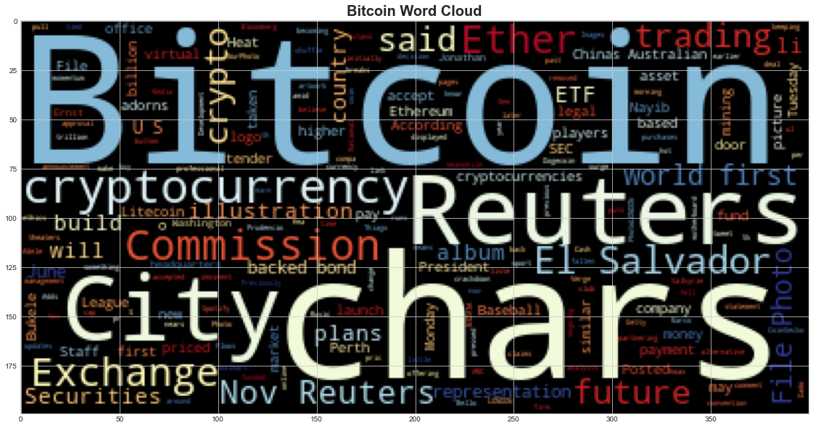
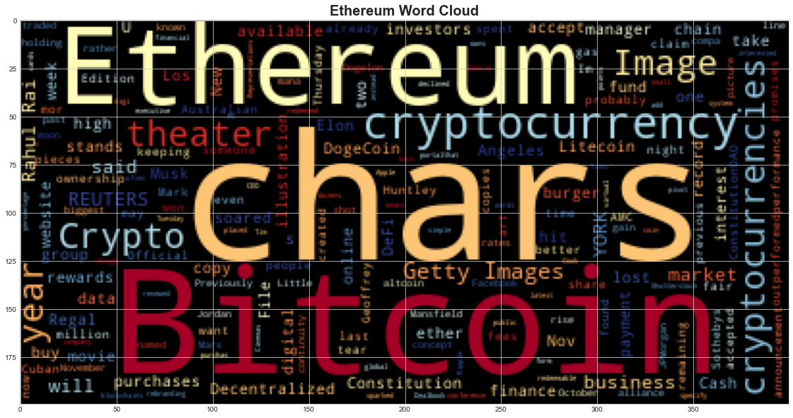

# Unit 12 - Tales from the Crypto

---


## 1. Sentiment Analysis

Use the [newsapi](https://newsapi.org/) to pull the latest news articles for Bitcoin and Ethereum and create a DataFrame of sentiment scores for each coin.

Use descriptive statistics to answer the following questions:
1. Which coin had the highest mean positive score?
2. Which coin had the highest negative score?
3. Which coin had the highest positive score?


```python
# Initial imports
import os
import pandas as pd
from dotenv import load_dotenv
import nltk as nltk
nltk.download('vader_lexicon')
from nltk.sentiment.vader import SentimentIntensityAnalyzer
analyzer = SentimentIntensityAnalyzer()

%matplotlib inline
```

    [nltk_data] Downloading package vader_lexicon to
    [nltk_data]     /Users/xbook/nltk_data...
    [nltk_data]   Package vader_lexicon is already up-to-date!


```python
# Read your api key environment variable
load_dotenv()
api_key = os.getenv("NEWS_API")

```


```python
# Create a newsapi client

from newsapi import NewsApiClient


newsapi = NewsApiClient(api_key=api_key)
```


```python
# Fetch the Bitcoin news articles
btc_news = newsapi.get_everything(q='bitcoin',
                                      language='en',
                                      sort_by='relevancy')
#btc_news['totalResults']
```


```python
# Fetch the Ethereum news articles
eth_news = newsapi.get_everything(q='ethereum',
                                      language='en',
                                      sort_by='relevancy')
#eth_news['totalResults']
```


```python
# Create the Bitcoin sentiment scores DataFrame
btc_sentiments = []

for article in btc_news["articles"]:
    try:
        text = article["content"]
        date = article["publishedAt"][:10]
        sentiment = analyzer.polarity_scores(text)
        compound = sentiment["compound"]
        pos = sentiment["pos"]
        neu = sentiment["neu"]
        neg = sentiment["neg"]
        
        btc_sentiments.append({
            
            "date": date,
            "compound": compound,
            "positive": pos,
            "negative": neg,
            "neutral": neu,
            "text": text,
            
        })
        
    except AttributeError:
        pass
# Create DataFrame
btc_df = pd.DataFrame(btc_sentiments)

btc_df
```


<div>
<style scoped>
    .dataframe tbody tr th:only-of-type {
        vertical-align: middle;
    }

    .dataframe tbody tr th {
        vertical-align: top;
    }

    .dataframe thead th {
        text-align: right;
    }
</style>
<table border="1" class="dataframe">
  <thead>
    <tr style="text-align: right;">
      <th></th>
      <th>date</th>
      <th>compound</th>
      <th>positive</th>
      <th>negative</th>
      <th>neutral</th>
      <th>text</th>
    </tr>
  </thead>
  <tbody>
    <tr>
      <th>0</th>
      <td>2021-11-05</td>
      <td>-0.2732</td>
      <td>0.000</td>
      <td>0.063</td>
      <td>0.937</td>
      <td>A similar hoax earlier this year tied Walmart ...</td>
    </tr>
    <tr>
      <th>1</th>
      <td>2021-11-22</td>
      <td>0.0000</td>
      <td>0.000</td>
      <td>0.000</td>
      <td>1.000</td>
      <td>MIZATA, El Salvador/LONDON, Nov 22 (Reuters) -...</td>
    </tr>
    <tr>
      <th>2</th>
      <td>2021-11-12</td>
      <td>0.5719</td>
      <td>0.153</td>
      <td>0.000</td>
      <td>0.847</td>
      <td>In keeping with a previous announcement, AMC t...</td>
    </tr>
    <tr>
      <th>3</th>
      <td>2021-11-22</td>
      <td>0.4767</td>
      <td>0.136</td>
      <td>0.000</td>
      <td>0.864</td>
      <td>Posted \r\nAfter becoming the first country to...</td>
    </tr>
    <tr>
      <th>4</th>
      <td>2021-11-02</td>
      <td>0.5719</td>
      <td>0.148</td>
      <td>0.000</td>
      <td>0.852</td>
      <td>Bitcoin artwork displayed at the Bitcoin 2021 ...</td>
    </tr>
    <tr>
      <th>5</th>
      <td>2021-11-22</td>
      <td>0.0000</td>
      <td>0.000</td>
      <td>0.000</td>
      <td>1.000</td>
      <td>Spotify has removed the shuffle button from al...</td>
    </tr>
    <tr>
      <th>6</th>
      <td>2021-11-06</td>
      <td>0.4767</td>
      <td>0.110</td>
      <td>0.000</td>
      <td>0.890</td>
      <td>Ether.\r\nNurPhoto\r\n&lt;ul&gt;&lt;li&gt;The approval of ...</td>
    </tr>
    <tr>
      <th>7</th>
      <td>2021-11-08</td>
      <td>0.0000</td>
      <td>0.000</td>
      <td>0.000</td>
      <td>1.000</td>
      <td>Bitcoin was trading over 7% higher on Monday m...</td>
    </tr>
    <tr>
      <th>8</th>
      <td>2021-11-17</td>
      <td>-0.1027</td>
      <td>0.000</td>
      <td>0.043</td>
      <td>0.957</td>
      <td>Australian Baseball League club Perth Heat wil...</td>
    </tr>
    <tr>
      <th>9</th>
      <td>2021-11-09</td>
      <td>0.0000</td>
      <td>0.000</td>
      <td>0.000</td>
      <td>1.000</td>
      <td>* Bitcoin breaks past $68,000; Ether nears $5k...</td>
    </tr>
    <tr>
      <th>10</th>
      <td>2021-11-23</td>
      <td>0.0000</td>
      <td>0.000</td>
      <td>0.000</td>
      <td>1.000</td>
      <td>Posted \r\nEl Salvador plans to build the worl...</td>
    </tr>
    <tr>
      <th>11</th>
      <td>2021-11-16</td>
      <td>0.0000</td>
      <td>0.000</td>
      <td>0.000</td>
      <td>1.000</td>
      <td>Representations of the virtual currency Bitcoi...</td>
    </tr>
    <tr>
      <th>12</th>
      <td>2021-11-16</td>
      <td>-0.6808</td>
      <td>0.000</td>
      <td>0.167</td>
      <td>0.833</td>
      <td>Bitcoin has fallen amid Chinas ongoing crackdo...</td>
    </tr>
    <tr>
      <th>13</th>
      <td>2021-11-18</td>
      <td>0.0000</td>
      <td>0.000</td>
      <td>0.000</td>
      <td>1.000</td>
      <td>The incoming mayor of New York City thinks cry...</td>
    </tr>
    <tr>
      <th>14</th>
      <td>2021-11-17</td>
      <td>0.5709</td>
      <td>0.112</td>
      <td>0.038</td>
      <td>0.849</td>
      <td>By Reuters Staff\r\nNov 17 (Reuters) - Perth H...</td>
    </tr>
    <tr>
      <th>15</th>
      <td>2021-11-15</td>
      <td>0.3612</td>
      <td>0.079</td>
      <td>0.000</td>
      <td>0.921</td>
      <td>Blue bitcoin\r\nYuichiro Chino\r\nAsset manage...</td>
    </tr>
    <tr>
      <th>16</th>
      <td>2021-11-23</td>
      <td>-0.1531</td>
      <td>0.045</td>
      <td>0.062</td>
      <td>0.893</td>
      <td>MEXICO CITY, Nov 22 (Reuters) - The Internatio...</td>
    </tr>
    <tr>
      <th>17</th>
      <td>2021-11-08</td>
      <td>0.0000</td>
      <td>0.000</td>
      <td>0.000</td>
      <td>1.000</td>
      <td>A representation of the virtual cryptocurrency...</td>
    </tr>
    <tr>
      <th>18</th>
      <td>2021-11-12</td>
      <td>0.4019</td>
      <td>0.113</td>
      <td>0.000</td>
      <td>0.887</td>
      <td>The U.S. Securities and Exchange Commission lo...</td>
    </tr>
    <tr>
      <th>19</th>
      <td>2021-11-12</td>
      <td>0.4019</td>
      <td>0.113</td>
      <td>0.000</td>
      <td>0.887</td>
      <td>By Reuters Staff\r\nFILE PHOTO: The U.S. Secur...</td>
    </tr>
  </tbody>
</table>
</div>


```python
# Create the Ethereum sentiment scores DataFrame
eth_sentiments = []

for article in eth_news["articles"]:
    try:
        text = article["content"]
        date = article["publishedAt"][:10]
        sentiment = analyzer.polarity_scores(text)
        compound = sentiment["compound"]
        pos = sentiment["pos"]
        neu = sentiment["neu"]
        neg = sentiment["neg"]
        
        eth_sentiments.append({
            
            "date": date,
            "compound": compound,
            "positive": pos,
            "negative": neg,
            "neutral": neu,
            "text": text,
            
        })
        
    except AttributeError:
        pass
# Create DataFrame
eth_df = pd.DataFrame(eth_sentiments)

eth_df
```


<div>
<style scoped>
    .dataframe tbody tr th:only-of-type {
        vertical-align: middle;
    }

    .dataframe tbody tr th {
        vertical-align: top;
    }

    .dataframe thead th {
        text-align: right;
    }
</style>
<table border="1" class="dataframe">
  <thead>
    <tr style="text-align: right;">
      <th></th>
      <th>date</th>
      <th>compound</th>
      <th>positive</th>
      <th>negative</th>
      <th>neutral</th>
      <th>text</th>
    </tr>
  </thead>
  <tbody>
    <tr>
      <th>0</th>
      <td>2021-11-19</td>
      <td>0.7783</td>
      <td>0.216</td>
      <td>0.000</td>
      <td>0.784</td>
      <td>If you claim ownership, someone will probably ...</td>
    </tr>
    <tr>
      <th>1</th>
      <td>2021-11-24</td>
      <td>0.0000</td>
      <td>0.000</td>
      <td>0.000</td>
      <td>1.000</td>
      <td>More than $1.2 million has already been spent ...</td>
    </tr>
    <tr>
      <th>2</th>
      <td>2021-11-23</td>
      <td>0.6542</td>
      <td>0.178</td>
      <td>0.000</td>
      <td>0.822</td>
      <td>Ethereum has been on a tear this year. Its out...</td>
    </tr>
    <tr>
      <th>3</th>
      <td>2021-11-12</td>
      <td>0.5719</td>
      <td>0.153</td>
      <td>0.000</td>
      <td>0.847</td>
      <td>In keeping with a previous announcement, AMC t...</td>
    </tr>
    <tr>
      <th>4</th>
      <td>2021-11-05</td>
      <td>0.4588</td>
      <td>0.094</td>
      <td>0.000</td>
      <td>0.906</td>
      <td>Ethereum and bitcoin are the two biggest crypt...</td>
    </tr>
    <tr>
      <th>5</th>
      <td>2021-11-01</td>
      <td>0.5267</td>
      <td>0.093</td>
      <td>0.000</td>
      <td>0.907</td>
      <td>Elon Musk\r\npicture alliance / Getty Images\r...</td>
    </tr>
    <tr>
      <th>6</th>
      <td>2021-11-01</td>
      <td>0.4588</td>
      <td>0.097</td>
      <td>0.000</td>
      <td>0.903</td>
      <td>Cryptocurrency and business continuity line im...</td>
    </tr>
    <tr>
      <th>7</th>
      <td>2021-11-09</td>
      <td>0.4019</td>
      <td>0.076</td>
      <td>0.000</td>
      <td>0.924</td>
      <td>Apple CEO Tim Cook said he owns cryptocurrency...</td>
    </tr>
    <tr>
      <th>8</th>
      <td>2021-11-23</td>
      <td>0.3818</td>
      <td>0.080</td>
      <td>0.000</td>
      <td>0.920</td>
      <td>Regal movie theater.Shutterstock\r\nMovie-thea...</td>
    </tr>
    <tr>
      <th>9</th>
      <td>2021-11-10</td>
      <td>0.8176</td>
      <td>0.221</td>
      <td>0.000</td>
      <td>0.779</td>
      <td>With crypto rewards cards, a small percentage ...</td>
    </tr>
    <tr>
      <th>10</th>
      <td>2021-11-29</td>
      <td>0.0000</td>
      <td>0.000</td>
      <td>0.000</td>
      <td>1.000</td>
      <td>Decentralized finance or DeFi is a global fina...</td>
    </tr>
    <tr>
      <th>11</th>
      <td>2021-11-01</td>
      <td>0.0000</td>
      <td>0.000</td>
      <td>0.000</td>
      <td>1.000</td>
      <td>Representations of cryptocurrencies Bitcoin, E...</td>
    </tr>
    <tr>
      <th>12</th>
      <td>2021-11-19</td>
      <td>-0.3182</td>
      <td>0.000</td>
      <td>0.062</td>
      <td>0.938</td>
      <td>Bitcoin has lost almost 20 per cent in less th...</td>
    </tr>
    <tr>
      <th>13</th>
      <td>2021-11-01</td>
      <td>0.5423</td>
      <td>0.099</td>
      <td>0.000</td>
      <td>0.901</td>
      <td>Grill burger chain Burger King announced a par...</td>
    </tr>
    <tr>
      <th>14</th>
      <td>2021-11-19</td>
      <td>0.0772</td>
      <td>0.070</td>
      <td>0.062</td>
      <td>0.867</td>
      <td>Image source, Getty Images\r\nImage caption, T...</td>
    </tr>
    <tr>
      <th>15</th>
      <td>2021-11-07</td>
      <td>0.0000</td>
      <td>0.000</td>
      <td>0.000</td>
      <td>1.000</td>
      <td>Rahul Rai, co-head of Market Neutral at BlockT...</td>
    </tr>
    <tr>
      <th>16</th>
      <td>2021-11-18</td>
      <td>0.0000</td>
      <td>0.000</td>
      <td>0.000</td>
      <td>1.000</td>
      <td>Hours ago, a website appeared online with the ...</td>
    </tr>
    <tr>
      <th>17</th>
      <td>2021-10-29</td>
      <td>0.0000</td>
      <td>0.000</td>
      <td>0.000</td>
      <td>1.000</td>
      <td>Ether, the second-largest cryptocurrency, soar...</td>
    </tr>
    <tr>
      <th>18</th>
      <td>2021-11-08</td>
      <td>0.3612</td>
      <td>0.072</td>
      <td>0.000</td>
      <td>0.928</td>
      <td>NEW YORK, Nov 8 (Reuters) - Inflows into bitco...</td>
    </tr>
    <tr>
      <th>19</th>
      <td>2021-11-16</td>
      <td>0.0000</td>
      <td>0.000</td>
      <td>0.000</td>
      <td>1.000</td>
      <td>An American Airlines Airbus A321-200 plane tak...</td>
    </tr>
  </tbody>
</table>
</div>


```python
# Describe the Bitcoin Sentiment
btc_df.describe()
```


<div>
<style scoped>
    .dataframe tbody tr th:only-of-type {
        vertical-align: middle;
    }

    .dataframe tbody tr th {
        vertical-align: top;
    }

    .dataframe thead th {
        text-align: right;
    }
</style>
<table border="1" class="dataframe">
  <thead>
    <tr style="text-align: right;">
      <th></th>
      <th>compound</th>
      <th>positive</th>
      <th>negative</th>
      <th>neutral</th>
    </tr>
  </thead>
  <tbody>
    <tr>
      <th>count</th>
      <td>20.000000</td>
      <td>20.000000</td>
      <td>20.000000</td>
      <td>20.000000</td>
    </tr>
    <tr>
      <th>mean</th>
      <td>0.131165</td>
      <td>0.050450</td>
      <td>0.018650</td>
      <td>0.930850</td>
    </tr>
    <tr>
      <th>std</th>
      <td>0.333726</td>
      <td>0.061281</td>
      <td>0.041064</td>
      <td>0.064893</td>
    </tr>
    <tr>
      <th>min</th>
      <td>-0.680800</td>
      <td>0.000000</td>
      <td>0.000000</td>
      <td>0.833000</td>
    </tr>
    <tr>
      <th>25%</th>
      <td>0.000000</td>
      <td>0.000000</td>
      <td>0.000000</td>
      <td>0.881250</td>
    </tr>
    <tr>
      <th>50%</th>
      <td>0.000000</td>
      <td>0.000000</td>
      <td>0.000000</td>
      <td>0.929000</td>
    </tr>
    <tr>
      <th>75%</th>
      <td>0.420600</td>
      <td>0.112250</td>
      <td>0.009500</td>
      <td>1.000000</td>
    </tr>
    <tr>
      <th>max</th>
      <td>0.571900</td>
      <td>0.153000</td>
      <td>0.167000</td>
      <td>1.000000</td>
    </tr>
  </tbody>
</table>
</div>


```python
# Describe the Ethereum Sentiment
eth_df.describe()
```


<div>
<style scoped>
    .dataframe tbody tr th:only-of-type {
        vertical-align: middle;
    }

    .dataframe tbody tr th {
        vertical-align: top;
    }

    .dataframe thead th {
        text-align: right;
    }
</style>
<table border="1" class="dataframe">
  <thead>
    <tr style="text-align: right;">
      <th></th>
      <th>compound</th>
      <th>positive</th>
      <th>negative</th>
      <th>neutral</th>
    </tr>
  </thead>
  <tbody>
    <tr>
      <th>count</th>
      <td>20.000000</td>
      <td>20.000000</td>
      <td>20.000000</td>
      <td>20.000000</td>
    </tr>
    <tr>
      <th>mean</th>
      <td>0.285625</td>
      <td>0.072450</td>
      <td>0.006200</td>
      <td>0.921300</td>
    </tr>
    <tr>
      <th>std</th>
      <td>0.319136</td>
      <td>0.074185</td>
      <td>0.019083</td>
      <td>0.073379</td>
    </tr>
    <tr>
      <th>min</th>
      <td>-0.318200</td>
      <td>0.000000</td>
      <td>0.000000</td>
      <td>0.779000</td>
    </tr>
    <tr>
      <th>25%</th>
      <td>0.000000</td>
      <td>0.000000</td>
      <td>0.000000</td>
      <td>0.892500</td>
    </tr>
    <tr>
      <th>50%</th>
      <td>0.371500</td>
      <td>0.074000</td>
      <td>0.000000</td>
      <td>0.922000</td>
    </tr>
    <tr>
      <th>75%</th>
      <td>0.530600</td>
      <td>0.097500</td>
      <td>0.000000</td>
      <td>1.000000</td>
    </tr>
    <tr>
      <th>max</th>
      <td>0.817600</td>
      <td>0.221000</td>
      <td>0.062000</td>
      <td>1.000000</td>
    </tr>
  </tbody>
</table>
</div>


### Questions:

Q: Which coin had the highest mean positive score?

A: **Ethereum**

Q: Which coin had the highest compound score?

A: **Ethereum**

Q. Which coin had the highest positive score?

A: **Ethereum**

---

## 2. Natural Language Processing
---
###   Tokenizer

In this section, you will use NLTK and Python to tokenize the text for each coin. Be sure to:
1. Lowercase each word.
2. Remove Punctuation.
3. Remove Stopwords.


```python
from nltk.tokenize import word_tokenize, sent_tokenize
from nltk.corpus import stopwords
from nltk.stem import WordNetLemmatizer, PorterStemmer
from string import punctuation
import re
```


```python
# Instantiate the lemmatizer
lemmatizer = WordNetLemmatizer()

# Create a list of stopwords
sw = set(stopwords.words('english'))

# Expand the default stopwords list if necessary
# YOUR CODE HERE!
```


```python
# Complete the tokenizer function
def tokenizer(text):
    """Tokenizes text."""
    
    # Remove the punctuation from text
    regex = re.compile("[^a-zA-Z  ]")
    re_clean = regex.sub('', text)   

   
    # Create a tokenized list of the words
    words = word_tokenize(re_clean.lower())
 
    
    # Lemmatize words into root words
    rw = [lemmatizer.lemmatize(word) for word in words]

   
    # Convert the words to lowercase
    words = [word for word in words if word not in sw]

    
    # Remove the stop words
    tokens = [word.lower() for word in words if word.lower() not in sw]

    
    return tokens
```


```python
# Create a new tokens column for Bitcoin
btc_df['tokens'] = btc_df['text'].apply(tokenizer)
btc_df.head()
```


<div>
<style scoped>
    .dataframe tbody tr th:only-of-type {
        vertical-align: middle;
    }

    .dataframe tbody tr th {
        vertical-align: top;
    }

    .dataframe thead th {
        text-align: right;
    }
</style>
<table border="1" class="dataframe">
  <thead>
    <tr style="text-align: right;">
      <th></th>
      <th>date</th>
      <th>compound</th>
      <th>positive</th>
      <th>negative</th>
      <th>neutral</th>
      <th>text</th>
      <th>tokens</th>
    </tr>
  </thead>
  <tbody>
    <tr>
      <th>0</th>
      <td>2021-11-05</td>
      <td>-0.2732</td>
      <td>0.000</td>
      <td>0.063</td>
      <td>0.937</td>
      <td>A similar hoax earlier this year tied Walmart ...</td>
      <td>[similar, hoax, earlier, year, tied, walmart, ...</td>
    </tr>
    <tr>
      <th>1</th>
      <td>2021-11-22</td>
      <td>0.0000</td>
      <td>0.000</td>
      <td>0.000</td>
      <td>1.000</td>
      <td>MIZATA, El Salvador/LONDON, Nov 22 (Reuters) -...</td>
      <td>[mizata, el, salvadorlondon, nov, reuters, el,...</td>
    </tr>
    <tr>
      <th>2</th>
      <td>2021-11-12</td>
      <td>0.5719</td>
      <td>0.153</td>
      <td>0.000</td>
      <td>0.847</td>
      <td>In keeping with a previous announcement, AMC t...</td>
      <td>[keeping, previous, announcement, amc, theater...</td>
    </tr>
    <tr>
      <th>3</th>
      <td>2021-11-22</td>
      <td>0.4767</td>
      <td>0.136</td>
      <td>0.000</td>
      <td>0.864</td>
      <td>Posted \r\nAfter becoming the first country to...</td>
      <td>[posted, becoming, first, country, accept, cry...</td>
    </tr>
    <tr>
      <th>4</th>
      <td>2021-11-02</td>
      <td>0.5719</td>
      <td>0.148</td>
      <td>0.000</td>
      <td>0.852</td>
      <td>Bitcoin artwork displayed at the Bitcoin 2021 ...</td>
      <td>[bitcoin, artwork, displayed, bitcoin, convent...</td>
    </tr>
  </tbody>
</table>
</div>


```python
# Create a new tokens column for Ethereum
eth_df['tokens'] = eth_df['text'].apply(tokenizer)
eth_df.head()
```


<div>
<style scoped>
    .dataframe tbody tr th:only-of-type {
        vertical-align: middle;
    }

    .dataframe tbody tr th {
        vertical-align: top;
    }

    .dataframe thead th {
        text-align: right;
    }
</style>
<table border="1" class="dataframe">
  <thead>
    <tr style="text-align: right;">
      <th></th>
      <th>date</th>
      <th>compound</th>
      <th>positive</th>
      <th>negative</th>
      <th>neutral</th>
      <th>text</th>
      <th>tokens</th>
    </tr>
  </thead>
  <tbody>
    <tr>
      <th>0</th>
      <td>2021-11-19</td>
      <td>0.7783</td>
      <td>0.216</td>
      <td>0.0</td>
      <td>0.784</td>
      <td>If you claim ownership, someone will probably ...</td>
      <td>[claim, ownership, someone, probably, want, ta...</td>
    </tr>
    <tr>
      <th>1</th>
      <td>2021-11-24</td>
      <td>0.0000</td>
      <td>0.000</td>
      <td>0.0</td>
      <td>1.000</td>
      <td>More than $1.2 million has already been spent ...</td>
      <td>[million, already, spent, gas, feesone, remain...</td>
    </tr>
    <tr>
      <th>2</th>
      <td>2021-11-23</td>
      <td>0.6542</td>
      <td>0.178</td>
      <td>0.0</td>
      <td>0.822</td>
      <td>Ethereum has been on a tear this year. Its out...</td>
      <td>[ethereum, tear, year, outperformed, bitcoin, ...</td>
    </tr>
    <tr>
      <th>3</th>
      <td>2021-11-12</td>
      <td>0.5719</td>
      <td>0.153</td>
      <td>0.0</td>
      <td>0.847</td>
      <td>In keeping with a previous announcement, AMC t...</td>
      <td>[keeping, previous, announcement, amc, theater...</td>
    </tr>
    <tr>
      <th>4</th>
      <td>2021-11-05</td>
      <td>0.4588</td>
      <td>0.094</td>
      <td>0.0</td>
      <td>0.906</td>
      <td>Ethereum and bitcoin are the two biggest crypt...</td>
      <td>[ethereum, bitcoin, two, biggest, cryptocurren...</td>
    </tr>
  </tbody>
</table>
</div>


---

### NGrams and Frequency Analysis

In this section you will look at the ngrams and word frequency for each coin. 

1. Use NLTK to produce the n-grams for N = 2. 
2. List the top 10 words for each coin. 


```python
from collections import Counter
from nltk import ngrams
```


```python
# Generate the Bitcoin N-grams where N=2
btc_text = ' '.join(btc_df.text)
btc_processed = tokenizer(btc_text)
btc_ngrams = Counter(ngrams(btc_processed, n=2))
print(dict(btc_ngrams.most_common(10)))
```

    {('el', 'salvador'): 4, ('nov', 'reuters'): 3, ('salvador', 'plans'): 3, ('plans', 'build'): 3, ('build', 'worlds'): 3, ('worlds', 'first'): 3, ('first', 'bitcoin'): 3, ('bitcoin', 'city'): 3, ('securities', 'exchange'): 3, ('exchange', 'commission'): 3}


```python
# Generate the Ethereum N-grams where N=2
eth_text = ' '.join(eth_df.text)
eth_processed = tokenizer(eth_text)
eth_ngrams = Counter(ngrams(eth_processed, n=2))
print(dict(eth_ngrams.most_common(10)))
```

    {('chars', 'ethereum'): 2, ('theaters', 'accept'): 2, ('ethereum', 'bitcoin'): 2, ('new', 'york'): 2, ('decentralized', 'finance'): 2, ('bitcoin', 'ethereum'): 2, ('ethereum', 'dogecoin'): 2, ('rahul', 'rai'): 2, ('york', 'nov'): 2, ('los', 'angeles'): 2}


```python
# Function token_count generates the top 10 words for a given coin
def token_count(tokens, N=3):
    """Returns the top N tokens from the frequency count"""
    return Counter(tokens).most_common(N)
```


```python
# Use token_count to get the top 10 words for Bitcoin
btc_top10 = token_count(btc_processed)
btc_top10
```


    [('chars', 19), ('bitcoin', 16), ('reuters', 7)]


```python
# Use token_count to get the top 10 words for Ethereum
eth_top10 = token_count(eth_processed)
eth_top10
```


    [('chars', 20), ('bitcoin', 11), ('ethereum', 8)]


---

### Word Clouds

In this section, you will generate word clouds for each coin to summarize the news for each coin


```python
from wordcloud import WordCloud
import matplotlib.pyplot as plt
plt.style.use('seaborn-whitegrid')
import matplotlib as mpl
mpl.rcParams['figure.figsize'] = [20.0, 10.0]
```


```python
# Generate the Bitcoin word cloud
wc = WordCloud(colormap="RdYlBu").generate(btc_text)
plt.imshow(wc)
plt.title(label='Bitcoin Word Cloud', fontdict={'fontsize': 20, 'fontweight':'bold'})
```


    Text(0.5, 1.0, 'Bitcoin Word Cloud')


    

    


```python
# Generate the Ethereum word cloud
wc = WordCloud(colormap="RdYlBu").generate(eth_text)
plt.imshow(wc)
plt.title(label='Ethereum Word Cloud', fontdict={'fontsize': 20, 'fontweight':'bold'})
```


    Text(0.5, 1.0, 'Ethereum Word Cloud')


    

    


---
## 3. Named Entity Recognition

In this section, you will build a named entity recognition model for both Bitcoin and Ethereum, then visualize the tags using SpaCy.


```python
import spacy
from spacy import displacy
```


```python
# Load the spaCy model
nlp = spacy.load('en_core_web_sm')
```

---
### Bitcoin NER


```python
# Concatenate all of the Bitcoin text together
btc_text = ' '.join(btc_df.text)
btc_text
```


    'A similar hoax earlier this year tied Walmart to Litecoin\r\nIf you buy something from a Verge link, Vox Media may earn a commission. See our ethics statement.\r\nPhoto Illustration by Thiago Prudencio/S… [+1900 chars] MIZATA, El Salvador/LONDON, Nov 22 (Reuters) - El Salvador plans to build the world\'s first "Bitcoin City" with money from a $1 billion bitcoin-backed bond the country\'s President Nayib Bukele said o… [+3147 chars] In keeping with a previous announcement, AMC theaters now accept cryptocurrencies as payment for online purchases.\xa0\r\nBitcoin, Ethereum, Bitcoin Cash and Litecoin are accepted.\xa0\r\nPreviously, the compa… [+1036 chars] Posted \r\nAfter becoming the first country to accept the cryptocurrency as legal tender, El Salvador plans to build the world\'s first Bitcoin City, funded initially by bitcoin-backed bonds. Bitcoin artwork displayed at the Bitcoin 2021 convention.\r\nMarco Bello/Getty Images\r\nThe Securities and Exchange Commission will not make a decision on alternative asset management firm Valkyrie\'s pr… [+1492 chars] Spotify has removed the shuffle button from all album pages after Adele pressed the company for the change in time for the launch of her album 30. According to her own tweet\r\n, albums should be liste… [+3186 chars] Ether.\r\nNurPhoto\r\n<ul><li>The approval of a bitcoin futures-based ETF means a similar offering for ether is imminent.</li><li>Bloomberg analysts believe the first ether futures-based ETF could launch… [+1931 chars] Bitcoin was trading over 7% higher on Monday morning, priced around $66,105 per coin.\r\nEther, was trading over 3% higher, priced at $4,722.\r\nDogecoin, meanwhile, was up over 9%, trading at a little o… [+756 chars] Australian Baseball League club Perth Heat will pay its players in bitcoin, after partnering with a cryptocurrency payment company in a deal it claims to be a world first for professional sport.\r\nHea… [+2695 chars] * Bitcoin breaks past $68,000; Ether nears $5k\r\n* Both pull back later\r\n* CoinGecko puts crypto market cap at more than $3 trillion\r\n* Flows surge as momentum runs hot (Adds new comment, updates pric… [+3162 chars] Posted \r\nEl Salvador plans to build the world\'s first "Bitcoin City" with money from a $1 billion bitcoin-backed bond, according to the country\'s President Nayib Bukele. Here is what we know about th… [+92 chars] Representations of the virtual currency Bitcoin stand on a motherboard in this picture illustration taken May 20, 2021. REUTERS/Dado Ruvic/File PhotoLONDON, Nov 16 (Reuters) - Bitcoin fell below $60,… [+629 chars] Bitcoin has fallen amid Chinas ongoing crackdown on crypto mining.\r\nOn Tuesday, Chinas National Development and Reform Commission spokesperson Meng Wei said bitcoin mining is dangerous, consumes lots… [+1005 chars] The incoming mayor of New York City thinks cryptocurrency and blockchain technology are the future. Eric Adams has advocated to reshape the city into a crypto hotspot, with crypto being taught in sch… [+5815 chars] By Reuters Staff\r\nNov 17 (Reuters) - Perth Heat, one of the most successful Australian Baseball League sides, entered the cryptocurrency market by saying on Wednesday that they would pay players and … [+1484 chars] Blue bitcoin\r\nYuichiro Chino\r\nAsset manager VanEck\'s bitcoin futures exchange traded fund (ETF) will start trading Tuesday, the Chicago Board Options Exchange (Cboe) said in a notification.\r\nLast mon… [+1918 chars] MEXICO CITY, Nov 22 (Reuters) - The International Monetary Fund (IMF) on Monday said that considering risks related to bitcoin, El Salvador should not use the cryptocurrency as legal tender.\r\n"Given … [+1724 chars] A representation of the virtual cryptocurrency Ethereum is seen among representations of other cryptocurrencies in this picture illustration taken June 14, 2021. REUTERS/Edgar Su/IllustrationSYDNEY, … [+660 chars] The U.S. Securities and Exchange Commission logo adorns an office door at the SEC headquarters in Washington, June 24, 2011. REUTERS/Jonathan Ernst/File Photo/File PhotoNov 12 (Reuters) - The U.S. Se… [+1865 chars] By Reuters Staff\r\nFILE PHOTO: The U.S. Securities and Exchange Commission logo adorns an office door at the SEC headquarters in Washington, June 24, 2011. REUTERS/Jonathan Ernst/File Photo/File Photo… [+329 chars]'


```python
# Run the NER processor on all of the text
btc_doc = nlp(btc_text)

# Add a title to the document
btc_doc.user_data["title"] = "Bitcoin NER"
```


```python
# Render the visualization
displacy.render(btc_doc, style='ent')
```


<span class="tex2jax_ignore"><h2 style="margin: 0">Bitcoin NER</h2>

<div class="entities" style="line-height: 2.5; direction: ltr">A similar hoax 
<mark class="entity" style="background: #bfe1d9; padding: 0.45em 0.6em; margin: 0 0.25em; line-height: 1; border-radius: 0.35em;">
    earlier this year
    <span style="font-size: 0.8em; font-weight: bold; line-height: 1; border-radius: 0.35em; vertical-align: middle; margin-left: 0.5rem">DATE</span>
</mark>
 tied Walmart to Litecoin
</br>If you buy something from a 
<mark class="entity" style="background: #ff8197; padding: 0.45em 0.6em; margin: 0 0.25em; line-height: 1; border-radius: 0.35em;">
    Verge
    <span style="font-size: 0.8em; font-weight: bold; line-height: 1; border-radius: 0.35em; vertical-align: middle; margin-left: 0.5rem">LAW</span>
</mark>
 link, 
<mark class="entity" style="background: #7aecec; padding: 0.45em 0.6em; margin: 0 0.25em; line-height: 1; border-radius: 0.35em;">
    Vox Media
    <span style="font-size: 0.8em; font-weight: bold; line-height: 1; border-radius: 0.35em; vertical-align: middle; margin-left: 0.5rem">ORG</span>
</mark>
 may earn a commission. See our ethics statement.
</br>
<mark class="entity" style="background: #7aecec; padding: 0.45em 0.6em; margin: 0 0.25em; line-height: 1; border-radius: 0.35em;">
    Photo Illustration
    <span style="font-size: 0.8em; font-weight: bold; line-height: 1; border-radius: 0.35em; vertical-align: middle; margin-left: 0.5rem">ORG</span>
</mark>
 by 
<mark class="entity" style="background: #aa9cfc; padding: 0.45em 0.6em; margin: 0 0.25em; line-height: 1; border-radius: 0.35em;">
    Thiago Prudencio/S
    <span style="font-size: 0.8em; font-weight: bold; line-height: 1; border-radius: 0.35em; vertical-align: middle; margin-left: 0.5rem">PERSON</span>
</mark>
… [+1900 chars] MIZATA, 
<mark class="entity" style="background: #feca74; padding: 0.45em 0.6em; margin: 0 0.25em; line-height: 1; border-radius: 0.35em;">
    El Salvador/
    <span style="font-size: 0.8em; font-weight: bold; line-height: 1; border-radius: 0.35em; vertical-align: middle; margin-left: 0.5rem">GPE</span>
</mark>
LONDON, Nov 22 (
<mark class="entity" style="background: #7aecec; padding: 0.45em 0.6em; margin: 0 0.25em; line-height: 1; border-radius: 0.35em;">
    Reuters
    <span style="font-size: 0.8em; font-weight: bold; line-height: 1; border-radius: 0.35em; vertical-align: middle; margin-left: 0.5rem">ORG</span>
</mark>
) - 
<mark class="entity" style="background: #feca74; padding: 0.45em 0.6em; margin: 0 0.25em; line-height: 1; border-radius: 0.35em;">
    El Salvador
    <span style="font-size: 0.8em; font-weight: bold; line-height: 1; border-radius: 0.35em; vertical-align: middle; margin-left: 0.5rem">GPE</span>
</mark>
 plans to build the world's 
<mark class="entity" style="background: #e4e7d2; padding: 0.45em 0.6em; margin: 0 0.25em; line-height: 1; border-radius: 0.35em;">
    first
    <span style="font-size: 0.8em; font-weight: bold; line-height: 1; border-radius: 0.35em; vertical-align: middle; margin-left: 0.5rem">ORDINAL</span>
</mark>
 &quot;
<mark class="entity" style="background: #feca74; padding: 0.45em 0.6em; margin: 0 0.25em; line-height: 1; border-radius: 0.35em;">
    Bitcoin City
    <span style="font-size: 0.8em; font-weight: bold; line-height: 1; border-radius: 0.35em; vertical-align: middle; margin-left: 0.5rem">GPE</span>
</mark>
&quot; with money from a 
<mark class="entity" style="background: #e4e7d2; padding: 0.45em 0.6em; margin: 0 0.25em; line-height: 1; border-radius: 0.35em;">
    $1 billion
    <span style="font-size: 0.8em; font-weight: bold; line-height: 1; border-radius: 0.35em; vertical-align: middle; margin-left: 0.5rem">MONEY</span>
</mark>
 bitcoin-backed bond the country's President 
<mark class="entity" style="background: #aa9cfc; padding: 0.45em 0.6em; margin: 0 0.25em; line-height: 1; border-radius: 0.35em;">
    Nayib Bukele
    <span style="font-size: 0.8em; font-weight: bold; line-height: 1; border-radius: 0.35em; vertical-align: middle; margin-left: 0.5rem">PERSON</span>
</mark>
 said o… [+3147 chars] In keeping with a previous announcement, 
<mark class="entity" style="background: #7aecec; padding: 0.45em 0.6em; margin: 0 0.25em; line-height: 1; border-radius: 0.35em;">
    AMC
    <span style="font-size: 0.8em; font-weight: bold; line-height: 1; border-radius: 0.35em; vertical-align: middle; margin-left: 0.5rem">ORG</span>
</mark>
 theaters now accept cryptocurrencies as payment for online purchases. 
</br>Bitcoin, Ethereum, Bitcoin Cash and Litecoin are accepted. 
</br>Previously, the compa… [+1036 chars] Posted 
</br>After becoming the 
<mark class="entity" style="background: #e4e7d2; padding: 0.45em 0.6em; margin: 0 0.25em; line-height: 1; border-radius: 0.35em;">
    first
    <span style="font-size: 0.8em; font-weight: bold; line-height: 1; border-radius: 0.35em; vertical-align: middle; margin-left: 0.5rem">ORDINAL</span>
</mark>
 country to accept the cryptocurrency as legal tender, 
<mark class="entity" style="background: #feca74; padding: 0.45em 0.6em; margin: 0 0.25em; line-height: 1; border-radius: 0.35em;">
    El Salvador
    <span style="font-size: 0.8em; font-weight: bold; line-height: 1; border-radius: 0.35em; vertical-align: middle; margin-left: 0.5rem">GPE</span>
</mark>
 plans to build the world's first 
<mark class="entity" style="background: #feca74; padding: 0.45em 0.6em; margin: 0 0.25em; line-height: 1; border-radius: 0.35em;">
    Bitcoin City
    <span style="font-size: 0.8em; font-weight: bold; line-height: 1; border-radius: 0.35em; vertical-align: middle; margin-left: 0.5rem">GPE</span>
</mark>
, funded initially by bitcoin-backed bonds. Bitcoin artwork displayed at the 
<mark class="entity" style="background: #bfe1d9; padding: 0.45em 0.6em; margin: 0 0.25em; line-height: 1; border-radius: 0.35em;">
    Bitcoin 2021
    <span style="font-size: 0.8em; font-weight: bold; line-height: 1; border-radius: 0.35em; vertical-align: middle; margin-left: 0.5rem">DATE</span>
</mark>
 convention.
</br>
<mark class="entity" style="background: #aa9cfc; padding: 0.45em 0.6em; margin: 0 0.25em; line-height: 1; border-radius: 0.35em;">
    Marco Bello/
    <span style="font-size: 0.8em; font-weight: bold; line-height: 1; border-radius: 0.35em; vertical-align: middle; margin-left: 0.5rem">PERSON</span>
</mark>
Getty Images
</br>
<mark class="entity" style="background: #7aecec; padding: 0.45em 0.6em; margin: 0 0.25em; line-height: 1; border-radius: 0.35em;">
    The Securities and Exchange Commission
    <span style="font-size: 0.8em; font-weight: bold; line-height: 1; border-radius: 0.35em; vertical-align: middle; margin-left: 0.5rem">ORG</span>
</mark>
 will not make a decision on alternative asset management firm 
<mark class="entity" style="background: #aa9cfc; padding: 0.45em 0.6em; margin: 0 0.25em; line-height: 1; border-radius: 0.35em;">
    Valkyrie
    <span style="font-size: 0.8em; font-weight: bold; line-height: 1; border-radius: 0.35em; vertical-align: middle; margin-left: 0.5rem">PERSON</span>
</mark>
's pr… [+1492 chars] 
<mark class="entity" style="background: #7aecec; padding: 0.45em 0.6em; margin: 0 0.25em; line-height: 1; border-radius: 0.35em;">
    Spotify
    <span style="font-size: 0.8em; font-weight: bold; line-height: 1; border-radius: 0.35em; vertical-align: middle; margin-left: 0.5rem">ORG</span>
</mark>
 has removed the shuffle button from all album pages after 
<mark class="entity" style="background: #aa9cfc; padding: 0.45em 0.6em; margin: 0 0.25em; line-height: 1; border-radius: 0.35em;">
    Adele
    <span style="font-size: 0.8em; font-weight: bold; line-height: 1; border-radius: 0.35em; vertical-align: middle; margin-left: 0.5rem">PERSON</span>
</mark>
 pressed the company for the change in time for the launch of her album 
<mark class="entity" style="background: #e4e7d2; padding: 0.45em 0.6em; margin: 0 0.25em; line-height: 1; border-radius: 0.35em;">
    30
    <span style="font-size: 0.8em; font-weight: bold; line-height: 1; border-radius: 0.35em; vertical-align: middle; margin-left: 0.5rem">CARDINAL</span>
</mark>
. According to her own tweet
</br>, albums should be liste… [
<mark class="entity" style="background: #7aecec; padding: 0.45em 0.6em; margin: 0 0.25em; line-height: 1; border-radius: 0.35em;">
    +3186
    <span style="font-size: 0.8em; font-weight: bold; line-height: 1; border-radius: 0.35em; vertical-align: middle; margin-left: 0.5rem">ORG</span>
</mark>
 chars] Ether.
</br>
<mark class="entity" style="background: #7aecec; padding: 0.45em 0.6em; margin: 0 0.25em; line-height: 1; border-radius: 0.35em;">
    NurPhoto
    <span style="font-size: 0.8em; font-weight: bold; line-height: 1; border-radius: 0.35em; vertical-align: middle; margin-left: 0.5rem">ORG</span>
</mark>

</br>&lt;ul&gt;&lt;li&gt;The approval of a bitcoin futures-based 
<mark class="entity" style="background: #7aecec; padding: 0.45em 0.6em; margin: 0 0.25em; line-height: 1; border-radius: 0.35em;">
    ETF
    <span style="font-size: 0.8em; font-weight: bold; line-height: 1; border-radius: 0.35em; vertical-align: middle; margin-left: 0.5rem">ORG</span>
</mark>
 means a similar offering for ether is imminent.&lt;/li&gt;&lt;li&gt;Bloomberg analysts believe the 
<mark class="entity" style="background: #e4e7d2; padding: 0.45em 0.6em; margin: 0 0.25em; line-height: 1; border-radius: 0.35em;">
    first
    <span style="font-size: 0.8em; font-weight: bold; line-height: 1; border-radius: 0.35em; vertical-align: middle; margin-left: 0.5rem">ORDINAL</span>
</mark>
 ether futures-based 
<mark class="entity" style="background: #7aecec; padding: 0.45em 0.6em; margin: 0 0.25em; line-height: 1; border-radius: 0.35em;">
    ETF
    <span style="font-size: 0.8em; font-weight: bold; line-height: 1; border-radius: 0.35em; vertical-align: middle; margin-left: 0.5rem">ORG</span>
</mark>
 could launch… [+1931 chars] Bitcoin was trading over 
<mark class="entity" style="background: #e4e7d2; padding: 0.45em 0.6em; margin: 0 0.25em; line-height: 1; border-radius: 0.35em;">
    7%
    <span style="font-size: 0.8em; font-weight: bold; line-height: 1; border-radius: 0.35em; vertical-align: middle; margin-left: 0.5rem">PERCENT</span>
</mark>
 higher on 
<mark class="entity" style="background: #bfe1d9; padding: 0.45em 0.6em; margin: 0 0.25em; line-height: 1; border-radius: 0.35em;">
    Monday
    <span style="font-size: 0.8em; font-weight: bold; line-height: 1; border-radius: 0.35em; vertical-align: middle; margin-left: 0.5rem">DATE</span>
</mark>

<mark class="entity" style="background: #bfe1d9; padding: 0.45em 0.6em; margin: 0 0.25em; line-height: 1; border-radius: 0.35em;">
    morning
    <span style="font-size: 0.8em; font-weight: bold; line-height: 1; border-radius: 0.35em; vertical-align: middle; margin-left: 0.5rem">TIME</span>
</mark>
, priced 
<mark class="entity" style="background: #e4e7d2; padding: 0.45em 0.6em; margin: 0 0.25em; line-height: 1; border-radius: 0.35em;">
    around $66,105
    <span style="font-size: 0.8em; font-weight: bold; line-height: 1; border-radius: 0.35em; vertical-align: middle; margin-left: 0.5rem">MONEY</span>
</mark>
 per coin.
</br>Ether, was trading over 
<mark class="entity" style="background: #e4e7d2; padding: 0.45em 0.6em; margin: 0 0.25em; line-height: 1; border-radius: 0.35em;">
    3%
    <span style="font-size: 0.8em; font-weight: bold; line-height: 1; border-radius: 0.35em; vertical-align: middle; margin-left: 0.5rem">PERCENT</span>
</mark>
 higher, priced at $
<mark class="entity" style="background: #e4e7d2; padding: 0.45em 0.6em; margin: 0 0.25em; line-height: 1; border-radius: 0.35em;">
    4,722
    <span style="font-size: 0.8em; font-weight: bold; line-height: 1; border-radius: 0.35em; vertical-align: middle; margin-left: 0.5rem">MONEY</span>
</mark>
.
</br>Dogecoin, meanwhile, was up 
<mark class="entity" style="background: #e4e7d2; padding: 0.45em 0.6em; margin: 0 0.25em; line-height: 1; border-radius: 0.35em;">
    over 9%
    <span style="font-size: 0.8em; font-weight: bold; line-height: 1; border-radius: 0.35em; vertical-align: middle; margin-left: 0.5rem">PERCENT</span>
</mark>
, trading at a little o… [+756 chars] 
<mark class="entity" style="background: #7aecec; padding: 0.45em 0.6em; margin: 0 0.25em; line-height: 1; border-radius: 0.35em;">
    Australian Baseball League
    <span style="font-size: 0.8em; font-weight: bold; line-height: 1; border-radius: 0.35em; vertical-align: middle; margin-left: 0.5rem">ORG</span>
</mark>
 club 
<mark class="entity" style="background: #aa9cfc; padding: 0.45em 0.6em; margin: 0 0.25em; line-height: 1; border-radius: 0.35em;">
    Perth Heat
    <span style="font-size: 0.8em; font-weight: bold; line-height: 1; border-radius: 0.35em; vertical-align: middle; margin-left: 0.5rem">PERSON</span>
</mark>
 will pay its players in bitcoin, after partnering with a cryptocurrency payment company in a deal it claims to be a world 
<mark class="entity" style="background: #e4e7d2; padding: 0.45em 0.6em; margin: 0 0.25em; line-height: 1; border-radius: 0.35em;">
    first
    <span style="font-size: 0.8em; font-weight: bold; line-height: 1; border-radius: 0.35em; vertical-align: middle; margin-left: 0.5rem">ORDINAL</span>
</mark>
 for professional sport.
</br>
<mark class="entity" style="background: #aa9cfc; padding: 0.45em 0.6em; margin: 0 0.25em; line-height: 1; border-radius: 0.35em;">
    Hea
    <span style="font-size: 0.8em; font-weight: bold; line-height: 1; border-radius: 0.35em; vertical-align: middle; margin-left: 0.5rem">PERSON</span>
</mark>
… [+2695 chars] * Bitcoin breaks past $
<mark class="entity" style="background: #e4e7d2; padding: 0.45em 0.6em; margin: 0 0.25em; line-height: 1; border-radius: 0.35em;">
    68,000
    <span style="font-size: 0.8em; font-weight: bold; line-height: 1; border-radius: 0.35em; vertical-align: middle; margin-left: 0.5rem">MONEY</span>
</mark>
; 
<mark class="entity" style="background: #7aecec; padding: 0.45em 0.6em; margin: 0 0.25em; line-height: 1; border-radius: 0.35em;">
    Ether
    <span style="font-size: 0.8em; font-weight: bold; line-height: 1; border-radius: 0.35em; vertical-align: middle; margin-left: 0.5rem">ORG</span>
</mark>
 nears $
<mark class="entity" style="background: #e4e7d2; padding: 0.45em 0.6em; margin: 0 0.25em; line-height: 1; border-radius: 0.35em;">
    5k
    <span style="font-size: 0.8em; font-weight: bold; line-height: 1; border-radius: 0.35em; vertical-align: middle; margin-left: 0.5rem">MONEY</span>
</mark>

</br>* Both pull back later
</br>* 
<mark class="entity" style="background: #7aecec; padding: 0.45em 0.6em; margin: 0 0.25em; line-height: 1; border-radius: 0.35em;">
    CoinGecko
    <span style="font-size: 0.8em; font-weight: bold; line-height: 1; border-radius: 0.35em; vertical-align: middle; margin-left: 0.5rem">ORG</span>
</mark>
 puts crypto market cap at 
<mark class="entity" style="background: #e4e7d2; padding: 0.45em 0.6em; margin: 0 0.25em; line-height: 1; border-radius: 0.35em;">
    more than $3 trillion
    <span style="font-size: 0.8em; font-weight: bold; line-height: 1; border-radius: 0.35em; vertical-align: middle; margin-left: 0.5rem">MONEY</span>
</mark>

</br>* Flows surge as momentum runs hot (Adds new comment, updates pric… [+3162 chars] Posted 
</br>
<mark class="entity" style="background: #feca74; padding: 0.45em 0.6em; margin: 0 0.25em; line-height: 1; border-radius: 0.35em;">
    El Salvador
    <span style="font-size: 0.8em; font-weight: bold; line-height: 1; border-radius: 0.35em; vertical-align: middle; margin-left: 0.5rem">GPE</span>
</mark>
 plans to build the world's 
<mark class="entity" style="background: #e4e7d2; padding: 0.45em 0.6em; margin: 0 0.25em; line-height: 1; border-radius: 0.35em;">
    first
    <span style="font-size: 0.8em; font-weight: bold; line-height: 1; border-radius: 0.35em; vertical-align: middle; margin-left: 0.5rem">ORDINAL</span>
</mark>
 &quot;
<mark class="entity" style="background: #feca74; padding: 0.45em 0.6em; margin: 0 0.25em; line-height: 1; border-radius: 0.35em;">
    Bitcoin City
    <span style="font-size: 0.8em; font-weight: bold; line-height: 1; border-radius: 0.35em; vertical-align: middle; margin-left: 0.5rem">GPE</span>
</mark>
&quot; with money from a 
<mark class="entity" style="background: #e4e7d2; padding: 0.45em 0.6em; margin: 0 0.25em; line-height: 1; border-radius: 0.35em;">
    $1 billion
    <span style="font-size: 0.8em; font-weight: bold; line-height: 1; border-radius: 0.35em; vertical-align: middle; margin-left: 0.5rem">MONEY</span>
</mark>
 bitcoin-backed bond, according to the country's President 
<mark class="entity" style="background: #aa9cfc; padding: 0.45em 0.6em; margin: 0 0.25em; line-height: 1; border-radius: 0.35em;">
    Nayib Bukele
    <span style="font-size: 0.8em; font-weight: bold; line-height: 1; border-radius: 0.35em; vertical-align: middle; margin-left: 0.5rem">PERSON</span>
</mark>
. Here is what we know about th… [+92 chars] Representations of the virtual currency Bitcoin stand on a motherboard in this picture illustration taken 
<mark class="entity" style="background: #bfe1d9; padding: 0.45em 0.6em; margin: 0 0.25em; line-height: 1; border-radius: 0.35em;">
    May 20, 2021
    <span style="font-size: 0.8em; font-weight: bold; line-height: 1; border-radius: 0.35em; vertical-align: middle; margin-left: 0.5rem">DATE</span>
</mark>
. 
<mark class="entity" style="background: #7aecec; padding: 0.45em 0.6em; margin: 0 0.25em; line-height: 1; border-radius: 0.35em;">
    REUTERS
    <span style="font-size: 0.8em; font-weight: bold; line-height: 1; border-radius: 0.35em; vertical-align: middle; margin-left: 0.5rem">ORG</span>
</mark>
/
<mark class="entity" style="background: #aa9cfc; padding: 0.45em 0.6em; margin: 0 0.25em; line-height: 1; border-radius: 0.35em;">
    Dado Ruvic/File PhotoLONDON
    <span style="font-size: 0.8em; font-weight: bold; line-height: 1; border-radius: 0.35em; vertical-align: middle; margin-left: 0.5rem">PERSON</span>
</mark>
, Nov 16 (
<mark class="entity" style="background: #7aecec; padding: 0.45em 0.6em; margin: 0 0.25em; line-height: 1; border-radius: 0.35em;">
    Reuters
    <span style="font-size: 0.8em; font-weight: bold; line-height: 1; border-radius: 0.35em; vertical-align: middle; margin-left: 0.5rem">ORG</span>
</mark>
) - Bitcoin fell below $
<mark class="entity" style="background: #e4e7d2; padding: 0.45em 0.6em; margin: 0 0.25em; line-height: 1; border-radius: 0.35em;">
    60
    <span style="font-size: 0.8em; font-weight: bold; line-height: 1; border-radius: 0.35em; vertical-align: middle; margin-left: 0.5rem">MONEY</span>
</mark>
,… [+629 chars] Bitcoin has fallen amid Chinas ongoing crackdown on crypto mining.
</br>On 
<mark class="entity" style="background: #bfe1d9; padding: 0.45em 0.6em; margin: 0 0.25em; line-height: 1; border-radius: 0.35em;">
    Tuesday
    <span style="font-size: 0.8em; font-weight: bold; line-height: 1; border-radius: 0.35em; vertical-align: middle; margin-left: 0.5rem">DATE</span>
</mark>
, 
<mark class="entity" style="background: #7aecec; padding: 0.45em 0.6em; margin: 0 0.25em; line-height: 1; border-radius: 0.35em;">
    Chinas National Development and Reform Commission
    <span style="font-size: 0.8em; font-weight: bold; line-height: 1; border-radius: 0.35em; vertical-align: middle; margin-left: 0.5rem">ORG</span>
</mark>
 spokesperson 
<mark class="entity" style="background: #aa9cfc; padding: 0.45em 0.6em; margin: 0 0.25em; line-height: 1; border-radius: 0.35em;">
    Meng Wei
    <span style="font-size: 0.8em; font-weight: bold; line-height: 1; border-radius: 0.35em; vertical-align: middle; margin-left: 0.5rem">PERSON</span>
</mark>
 said bitcoin mining is dangerous, consumes lots… [+1005 chars] The incoming mayor of 
<mark class="entity" style="background: #feca74; padding: 0.45em 0.6em; margin: 0 0.25em; line-height: 1; border-radius: 0.35em;">
    New York City
    <span style="font-size: 0.8em; font-weight: bold; line-height: 1; border-radius: 0.35em; vertical-align: middle; margin-left: 0.5rem">GPE</span>
</mark>
 thinks cryptocurrency and blockchain technology are the future. 
<mark class="entity" style="background: #aa9cfc; padding: 0.45em 0.6em; margin: 0 0.25em; line-height: 1; border-radius: 0.35em;">
    Eric Adams
    <span style="font-size: 0.8em; font-weight: bold; line-height: 1; border-radius: 0.35em; vertical-align: middle; margin-left: 0.5rem">PERSON</span>
</mark>
 has advocated to reshape the city into a crypto hotspot, with crypto being taught in sch… [+5815 chars] By 
<mark class="entity" style="background: #7aecec; padding: 0.45em 0.6em; margin: 0 0.25em; line-height: 1; border-radius: 0.35em;">
    Reuters
    <span style="font-size: 0.8em; font-weight: bold; line-height: 1; border-radius: 0.35em; vertical-align: middle; margin-left: 0.5rem">ORG</span>
</mark>
 Staff
</br>Nov 17 (
<mark class="entity" style="background: #7aecec; padding: 0.45em 0.6em; margin: 0 0.25em; line-height: 1; border-radius: 0.35em;">
    Reuters
    <span style="font-size: 0.8em; font-weight: bold; line-height: 1; border-radius: 0.35em; vertical-align: middle; margin-left: 0.5rem">ORG</span>
</mark>
) - Perth Heat, 
<mark class="entity" style="background: #e4e7d2; padding: 0.45em 0.6em; margin: 0 0.25em; line-height: 1; border-radius: 0.35em;">
    one
    <span style="font-size: 0.8em; font-weight: bold; line-height: 1; border-radius: 0.35em; vertical-align: middle; margin-left: 0.5rem">CARDINAL</span>
</mark>
 of the most successful 
<mark class="entity" style="background: #7aecec; padding: 0.45em 0.6em; margin: 0 0.25em; line-height: 1; border-radius: 0.35em;">
    Australian Baseball League
    <span style="font-size: 0.8em; font-weight: bold; line-height: 1; border-radius: 0.35em; vertical-align: middle; margin-left: 0.5rem">ORG</span>
</mark>
 sides, entered the cryptocurrency market by saying on 
<mark class="entity" style="background: #bfe1d9; padding: 0.45em 0.6em; margin: 0 0.25em; line-height: 1; border-radius: 0.35em;">
    Wednesday
    <span style="font-size: 0.8em; font-weight: bold; line-height: 1; border-radius: 0.35em; vertical-align: middle; margin-left: 0.5rem">DATE</span>
</mark>
 that they would pay players and … [+1484 chars] Blue bitcoin
</br>
<mark class="entity" style="background: #7aecec; padding: 0.45em 0.6em; margin: 0 0.25em; line-height: 1; border-radius: 0.35em;">
    Yuichiro
    <span style="font-size: 0.8em; font-weight: bold; line-height: 1; border-radius: 0.35em; vertical-align: middle; margin-left: 0.5rem">ORG</span>
</mark>

<mark class="entity" style="background: #7aecec; padding: 0.45em 0.6em; margin: 0 0.25em; line-height: 1; border-radius: 0.35em;">
    Chino
    <span style="font-size: 0.8em; font-weight: bold; line-height: 1; border-radius: 0.35em; vertical-align: middle; margin-left: 0.5rem">ORG</span>
</mark>

</br>Asset manager 
<mark class="entity" style="background: #7aecec; padding: 0.45em 0.6em; margin: 0 0.25em; line-height: 1; border-radius: 0.35em;">
    VanEck
    <span style="font-size: 0.8em; font-weight: bold; line-height: 1; border-radius: 0.35em; vertical-align: middle; margin-left: 0.5rem">ORG</span>
</mark>
's bitcoin futures exchange traded fund (
<mark class="entity" style="background: #7aecec; padding: 0.45em 0.6em; margin: 0 0.25em; line-height: 1; border-radius: 0.35em;">
    ETF
    <span style="font-size: 0.8em; font-weight: bold; line-height: 1; border-radius: 0.35em; vertical-align: middle; margin-left: 0.5rem">ORG</span>
</mark>
) will start trading 
<mark class="entity" style="background: #bfe1d9; padding: 0.45em 0.6em; margin: 0 0.25em; line-height: 1; border-radius: 0.35em;">
    Tuesday
    <span style="font-size: 0.8em; font-weight: bold; line-height: 1; border-radius: 0.35em; vertical-align: middle; margin-left: 0.5rem">DATE</span>
</mark>
, 
<mark class="entity" style="background: #7aecec; padding: 0.45em 0.6em; margin: 0 0.25em; line-height: 1; border-radius: 0.35em;">
    the Chicago Board Options Exchange
    <span style="font-size: 0.8em; font-weight: bold; line-height: 1; border-radius: 0.35em; vertical-align: middle; margin-left: 0.5rem">ORG</span>
</mark>
 (
<mark class="entity" style="background: #7aecec; padding: 0.45em 0.6em; margin: 0 0.25em; line-height: 1; border-radius: 0.35em;">
    Cboe
    <span style="font-size: 0.8em; font-weight: bold; line-height: 1; border-radius: 0.35em; vertical-align: middle; margin-left: 0.5rem">ORG</span>
</mark>
) said in a notification.
</br>
<mark class="entity" style="background: #bfe1d9; padding: 0.45em 0.6em; margin: 0 0.25em; line-height: 1; border-radius: 0.35em;">
    Last mon
    <span style="font-size: 0.8em; font-weight: bold; line-height: 1; border-radius: 0.35em; vertical-align: middle; margin-left: 0.5rem">DATE</span>
</mark>
… [+1918 chars] 
<mark class="entity" style="background: #feca74; padding: 0.45em 0.6em; margin: 0 0.25em; line-height: 1; border-radius: 0.35em;">
    MEXICO CITY
    <span style="font-size: 0.8em; font-weight: bold; line-height: 1; border-radius: 0.35em; vertical-align: middle; margin-left: 0.5rem">GPE</span>
</mark>
, Nov 22 (
<mark class="entity" style="background: #7aecec; padding: 0.45em 0.6em; margin: 0 0.25em; line-height: 1; border-radius: 0.35em;">
    Reuters
    <span style="font-size: 0.8em; font-weight: bold; line-height: 1; border-radius: 0.35em; vertical-align: middle; margin-left: 0.5rem">ORG</span>
</mark>
) - 
<mark class="entity" style="background: #7aecec; padding: 0.45em 0.6em; margin: 0 0.25em; line-height: 1; border-radius: 0.35em;">
    The International Monetary Fund
    <span style="font-size: 0.8em; font-weight: bold; line-height: 1; border-radius: 0.35em; vertical-align: middle; margin-left: 0.5rem">ORG</span>
</mark>
 (IMF) on 
<mark class="entity" style="background: #bfe1d9; padding: 0.45em 0.6em; margin: 0 0.25em; line-height: 1; border-radius: 0.35em;">
    Monday
    <span style="font-size: 0.8em; font-weight: bold; line-height: 1; border-radius: 0.35em; vertical-align: middle; margin-left: 0.5rem">DATE</span>
</mark>
 said that considering risks related to bitcoin, 
<mark class="entity" style="background: #feca74; padding: 0.45em 0.6em; margin: 0 0.25em; line-height: 1; border-radius: 0.35em;">
    El Salvador
    <span style="font-size: 0.8em; font-weight: bold; line-height: 1; border-radius: 0.35em; vertical-align: middle; margin-left: 0.5rem">GPE</span>
</mark>
 should not use the cryptocurrency as legal tender.
</br>&quot;Given … [+1724 chars] A representation of the virtual cryptocurrency 
<mark class="entity" style="background: #7aecec; padding: 0.45em 0.6em; margin: 0 0.25em; line-height: 1; border-radius: 0.35em;">
    Ethereum
    <span style="font-size: 0.8em; font-weight: bold; line-height: 1; border-radius: 0.35em; vertical-align: middle; margin-left: 0.5rem">ORG</span>
</mark>
 is seen among representations of other cryptocurrencies in this picture illustration taken 
<mark class="entity" style="background: #bfe1d9; padding: 0.45em 0.6em; margin: 0 0.25em; line-height: 1; border-radius: 0.35em;">
    June 14, 2021
    <span style="font-size: 0.8em; font-weight: bold; line-height: 1; border-radius: 0.35em; vertical-align: middle; margin-left: 0.5rem">DATE</span>
</mark>
. 
<mark class="entity" style="background: #7aecec; padding: 0.45em 0.6em; margin: 0 0.25em; line-height: 1; border-radius: 0.35em;">
    REUTERS
    <span style="font-size: 0.8em; font-weight: bold; line-height: 1; border-radius: 0.35em; vertical-align: middle; margin-left: 0.5rem">ORG</span>
</mark>
/
<mark class="entity" style="background: #aa9cfc; padding: 0.45em 0.6em; margin: 0 0.25em; line-height: 1; border-radius: 0.35em;">
    Edgar Su/IllustrationSYDNEY
    <span style="font-size: 0.8em; font-weight: bold; line-height: 1; border-radius: 0.35em; vertical-align: middle; margin-left: 0.5rem">PERSON</span>
</mark>
, … [+660 chars] 
<mark class="entity" style="background: #7aecec; padding: 0.45em 0.6em; margin: 0 0.25em; line-height: 1; border-radius: 0.35em;">
    The U.S. Securities and Exchange Commission
    <span style="font-size: 0.8em; font-weight: bold; line-height: 1; border-radius: 0.35em; vertical-align: middle; margin-left: 0.5rem">ORG</span>
</mark>
 logo adorns an office door at the 
<mark class="entity" style="background: #7aecec; padding: 0.45em 0.6em; margin: 0 0.25em; line-height: 1; border-radius: 0.35em;">
    SEC
    <span style="font-size: 0.8em; font-weight: bold; line-height: 1; border-radius: 0.35em; vertical-align: middle; margin-left: 0.5rem">ORG</span>
</mark>
 headquarters in 
<mark class="entity" style="background: #feca74; padding: 0.45em 0.6em; margin: 0 0.25em; line-height: 1; border-radius: 0.35em;">
    Washington
    <span style="font-size: 0.8em; font-weight: bold; line-height: 1; border-radius: 0.35em; vertical-align: middle; margin-left: 0.5rem">GPE</span>
</mark>
, 
<mark class="entity" style="background: #bfe1d9; padding: 0.45em 0.6em; margin: 0 0.25em; line-height: 1; border-radius: 0.35em;">
    June 24, 2011
    <span style="font-size: 0.8em; font-weight: bold; line-height: 1; border-radius: 0.35em; vertical-align: middle; margin-left: 0.5rem">DATE</span>
</mark>
. 
<mark class="entity" style="background: #7aecec; padding: 0.45em 0.6em; margin: 0 0.25em; line-height: 1; border-radius: 0.35em;">
    REUTERS
    <span style="font-size: 0.8em; font-weight: bold; line-height: 1; border-radius: 0.35em; vertical-align: middle; margin-left: 0.5rem">ORG</span>
</mark>
/
<mark class="entity" style="background: #aa9cfc; padding: 0.45em 0.6em; margin: 0 0.25em; line-height: 1; border-radius: 0.35em;">
    Jonathan Ernst/File Photo/File PhotoNov
    <span style="font-size: 0.8em; font-weight: bold; line-height: 1; border-radius: 0.35em; vertical-align: middle; margin-left: 0.5rem">PERSON</span>
</mark>

<mark class="entity" style="background: #e4e7d2; padding: 0.45em 0.6em; margin: 0 0.25em; line-height: 1; border-radius: 0.35em;">
    12
    <span style="font-size: 0.8em; font-weight: bold; line-height: 1; border-radius: 0.35em; vertical-align: middle; margin-left: 0.5rem">CARDINAL</span>
</mark>
 (
<mark class="entity" style="background: #7aecec; padding: 0.45em 0.6em; margin: 0 0.25em; line-height: 1; border-radius: 0.35em;">
    Reuters
    <span style="font-size: 0.8em; font-weight: bold; line-height: 1; border-radius: 0.35em; vertical-align: middle; margin-left: 0.5rem">ORG</span>
</mark>
) - 
<mark class="entity" style="background: #7aecec; padding: 0.45em 0.6em; margin: 0 0.25em; line-height: 1; border-radius: 0.35em;">
    The U.S. Se
    <span style="font-size: 0.8em; font-weight: bold; line-height: 1; border-radius: 0.35em; vertical-align: middle; margin-left: 0.5rem">ORG</span>
</mark>
… [+1865 chars] By 
<mark class="entity" style="background: #7aecec; padding: 0.45em 0.6em; margin: 0 0.25em; line-height: 1; border-radius: 0.35em;">
    Reuters
    <span style="font-size: 0.8em; font-weight: bold; line-height: 1; border-radius: 0.35em; vertical-align: middle; margin-left: 0.5rem">ORG</span>
</mark>
 Staff
</br>
<mark class="entity" style="background: #7aecec; padding: 0.45em 0.6em; margin: 0 0.25em; line-height: 1; border-radius: 0.35em;">
    FILE
    <span style="font-size: 0.8em; font-weight: bold; line-height: 1; border-radius: 0.35em; vertical-align: middle; margin-left: 0.5rem">ORG</span>
</mark>
 PHOTO: 
<mark class="entity" style="background: #7aecec; padding: 0.45em 0.6em; margin: 0 0.25em; line-height: 1; border-radius: 0.35em;">
    The U.S. Securities and Exchange Commission
    <span style="font-size: 0.8em; font-weight: bold; line-height: 1; border-radius: 0.35em; vertical-align: middle; margin-left: 0.5rem">ORG</span>
</mark>
 logo adorns an office door at the 
<mark class="entity" style="background: #7aecec; padding: 0.45em 0.6em; margin: 0 0.25em; line-height: 1; border-radius: 0.35em;">
    SEC
    <span style="font-size: 0.8em; font-weight: bold; line-height: 1; border-radius: 0.35em; vertical-align: middle; margin-left: 0.5rem">ORG</span>
</mark>
 headquarters in 
<mark class="entity" style="background: #feca74; padding: 0.45em 0.6em; margin: 0 0.25em; line-height: 1; border-radius: 0.35em;">
    Washington
    <span style="font-size: 0.8em; font-weight: bold; line-height: 1; border-radius: 0.35em; vertical-align: middle; margin-left: 0.5rem">GPE</span>
</mark>
, 
<mark class="entity" style="background: #bfe1d9; padding: 0.45em 0.6em; margin: 0 0.25em; line-height: 1; border-radius: 0.35em;">
    June 24, 2011
    <span style="font-size: 0.8em; font-weight: bold; line-height: 1; border-radius: 0.35em; vertical-align: middle; margin-left: 0.5rem">DATE</span>
</mark>
. 
<mark class="entity" style="background: #7aecec; padding: 0.45em 0.6em; margin: 0 0.25em; line-height: 1; border-radius: 0.35em;">
    REUTERS
    <span style="font-size: 0.8em; font-weight: bold; line-height: 1; border-radius: 0.35em; vertical-align: middle; margin-left: 0.5rem">ORG</span>
</mark>
/
<mark class="entity" style="background: #aa9cfc; padding: 0.45em 0.6em; margin: 0 0.25em; line-height: 1; border-radius: 0.35em;">
    Jonathan Ernst/File Photo/File Photo
    <span style="font-size: 0.8em; font-weight: bold; line-height: 1; border-radius: 0.35em; vertical-align: middle; margin-left: 0.5rem">PERSON</span>
</mark>
… [+329 chars]</div></span>


```python
# List all Entities
for ent in btc_doc.ents:
    print('{} {}'.format(ent.text, ent.label_))
```

    earlier this year DATE
    Verge LAW
    Vox Media ORG
    Photo Illustration ORG
    Thiago Prudencio/S PERSON
    El Salvador/ GPE
    Reuters ORG
    El Salvador GPE
    first ORDINAL
    Bitcoin City GPE
    $1 billion MONEY
    Nayib Bukele PERSON
    AMC ORG
    first ORDINAL
    El Salvador GPE
    Bitcoin City GPE
    Bitcoin 2021 DATE
    Marco Bello/ PERSON
    The Securities and Exchange Commission ORG
    Valkyrie PERSON
    Spotify ORG
    Adele PERSON
    30 CARDINAL
    +3186 ORG
    NurPhoto ORG
    ETF ORG
    first ORDINAL
    ETF ORG
    7% PERCENT
    Monday DATE
    morning TIME
    around $66,105 MONEY
    3% PERCENT
    4,722 MONEY
    over 9% PERCENT
    Australian Baseball League ORG
    Perth Heat PERSON
    first ORDINAL
    Hea PERSON
    68,000 MONEY
    Ether ORG
    5k MONEY
    CoinGecko ORG
    more than $3 trillion MONEY
    El Salvador GPE
    first ORDINAL
    Bitcoin City GPE
    $1 billion MONEY
    Nayib Bukele PERSON
    May 20, 2021 DATE
    REUTERS ORG
    Dado Ruvic/File PhotoLONDON PERSON
    Reuters ORG
    60 MONEY
    Tuesday DATE
    Chinas National Development and Reform Commission ORG
    Meng Wei PERSON
    New York City GPE
    Eric Adams PERSON
    Reuters ORG
    Reuters ORG
    one CARDINAL
    Australian Baseball League ORG
    Wednesday DATE
    Yuichiro ORG
    Chino ORG
    VanEck ORG
    ETF ORG
    Tuesday DATE
    the Chicago Board Options Exchange ORG
    Cboe ORG
    Last mon DATE
    MEXICO CITY GPE
    Reuters ORG
    The International Monetary Fund ORG
    Monday DATE
    El Salvador GPE
    Ethereum ORG
    June 14, 2021 DATE
    REUTERS ORG
    Edgar Su/IllustrationSYDNEY PERSON
    The U.S. Securities and Exchange Commission ORG
    SEC ORG
    Washington GPE
    June 24, 2011 DATE
    REUTERS ORG
    Jonathan Ernst/File Photo/File PhotoNov PERSON
    12 CARDINAL
    Reuters ORG
    The U.S. Se ORG
    Reuters ORG
    FILE ORG
    The U.S. Securities and Exchange Commission ORG
    SEC ORG
    Washington GPE
    June 24, 2011 DATE
    REUTERS ORG
    Jonathan Ernst/File Photo/File Photo PERSON


---

### Ethereum NER


```python
# Concatenate all of the Ethereum text together
eth_text = ' '.join(eth_df.text)
eth_text
```


    'If you claim ownership, someone will probably want to take it\r\nIn what may be one of the better pieces of performance art this year, Australian Geoffrey Huntley has created a website that promises to… [+4542 chars] More than $1.2 million has already been spent on gas fees\r\nOne of 13 remaining copies of the Official Edition of the Constitution.\r\nImage: Sothebys\r\nAs of last Thursday night, ConstitutionDAO found i… [+5262 chars] Ethereum has been on a tear this year. Its outperformed bitcoin this year and has hit an all-time high. Ethereum has even won over people like Mark Cuban.\r\nI have my fair share of bitcoin, but Im mor… [+10978 chars] In keeping with a previous announcement, AMC theaters now accept cryptocurrencies as payment for online purchases.\xa0\r\nBitcoin, Ethereum, Bitcoin Cash and Litecoin are accepted.\xa0\r\nPreviously, the compa… [+1036 chars] Ethereum and bitcoin are the two biggest cryptocurrencies.\r\nJordan Mansfield /Getty Images\r\nCrypto investors should be holding ethereum rather than bitcoin as interest rates rise, JPMorgan said, beca… [+2957 chars] Elon Musk\r\npicture alliance / Getty Images\r\nA cryptocurrency named after Elon Musk has shot to the moon with a 3,780% gain in October. \r\nDogelon Mars traded at $0.00000229 on November 1, up from $0.0… [+1533 chars] Cryptocurrency and business continuity line image for business concept.\r\nGetty Images\r\nLittle-known altcoin mana soared in the past week after Facebook\'s rebranding pivot sparked renewed interest in … [+1338 chars] Apple CEO Tim Cook said he owns cryptocurrency, though he declined to specify which virtual coin.\r\nDuring The New York Times\' Dealbook conference Tuesday, the executive said he\'s been interested in c… [+1451 chars] Regal movie theater.Shutterstock\r\nMovie-theater chain Regal Cinemas is the latest to add cryptocurrencies as a form payment.\r\nThe company, which has more than 500 theaters, will accept dozens of digi… [+1458 chars] With crypto rewards cards, a small percentage of your purchases can be redeemed for cryptocurrency instead of cash back or points that are redeemable in a rewards portalthat means 1-2% of all purchas… [+3232 chars] Decentralized finance or DeFi is a global financial system that\'s available on blockchains that are public most often Ethereum.\xa0\r\n"DeFi stands for decentralized finance. In simple words it stands for… [+7096 chars] Representations of cryptocurrencies Bitcoin, Ethereum, DogeCoin, Ripple, Litecoin are placed on PC motherboard in this illustration taken, June 29, 2021. REUTERS/Dado Ruvic/Illustration/File Photo MU… [+3384 chars] Bitcoin has lost almost 20 per cent in less than two weeks, proving that extreme volatility remains a hallmark of crypto investing.\xa0\r\nYet in the world of Bitcoin, its largely business as usual with b… [+2054 chars] Grill burger chain Burger King announced a partnership with Robinhood to give away Bitcoin , Ethereum and Dogecoin to members of its Royal Perks loyalty program to consumers who spend $ 5 on the rest… [+918 chars] Image source, Getty Images\r\nImage caption, The group had hoped to buy the copy using cryptocurrency Ethereum\r\nA cryptocurrency group has lost in its efforts to buy a rare copy of the US constitution … [+1020 chars] Rahul Rai, co-head of Market Neutral at BlockTower Capital.\r\nRahul Rai\r\nCrypto hedge fund manager Rahul Rai believes the market will see ether overtake bitcoin in terms of market capitalization befor… [+3221 chars] Hours ago, a website appeared online with the express purpose of hosting a nearly 20TB torrent (thats terabytes, folks, the big boys of digital data measurement) containing every NFT available throug… [+2692 chars] Ether, the second-largest cryptocurrency, soared to a record above $4,400 Friday on bullish sentiment surrounding an upgrade to the Ethereum network and rival Bitcoin’s recent rally to a high of its … [+1314 chars] NEW YORK, Nov 8 (Reuters) - Inflows into bitcoin products and funds have hit a record $6.4 billion so far this year, data from digital asset manager CoinShares showed, as investors bought the cryptoc… [+1848 chars] An American Airlines Airbus A321-200 plane takes off from Los Angeles International airport (LAX) in Los Angeles, California, U.S. March 28, 2018. REUTERS/Mike Blake/File PhotoNEW YORK, Nov 16 (Reute… [+1787 chars]'


```python
# Run the NER processor on all of the text
eth_doc = nlp(eth_text)

# Add a title to the document
eth_doc.user_data["title"] = "Ethereum NER"
```


```python
# Render the visualization
displacy.render(eth_doc, style='ent')
```


<span class="tex2jax_ignore"><h2 style="margin: 0">Ethereum NER</h2>

<div class="entities" style="line-height: 2.5; direction: ltr">If you claim ownership, someone will probably want to take it
</br>In what may be one of the better pieces of performance art 
<mark class="entity" style="background: #bfe1d9; padding: 0.45em 0.6em; margin: 0 0.25em; line-height: 1; border-radius: 0.35em;">
    this year
    <span style="font-size: 0.8em; font-weight: bold; line-height: 1; border-radius: 0.35em; vertical-align: middle; margin-left: 0.5rem">DATE</span>
</mark>
, 
<mark class="entity" style="background: #aa9cfc; padding: 0.45em 0.6em; margin: 0 0.25em; line-height: 1; border-radius: 0.35em;">
    Australian Geoffrey Huntley
    <span style="font-size: 0.8em; font-weight: bold; line-height: 1; border-radius: 0.35em; vertical-align: middle; margin-left: 0.5rem">PERSON</span>
</mark>
 has created a website that promises to… [+4542 chars] 
<mark class="entity" style="background: #e4e7d2; padding: 0.45em 0.6em; margin: 0 0.25em; line-height: 1; border-radius: 0.35em;">
    More than $1.2 million
    <span style="font-size: 0.8em; font-weight: bold; line-height: 1; border-radius: 0.35em; vertical-align: middle; margin-left: 0.5rem">MONEY</span>
</mark>
 has already been spent on gas fees
</br>
<mark class="entity" style="background: #e4e7d2; padding: 0.45em 0.6em; margin: 0 0.25em; line-height: 1; border-radius: 0.35em;">
    One
    <span style="font-size: 0.8em; font-weight: bold; line-height: 1; border-radius: 0.35em; vertical-align: middle; margin-left: 0.5rem">CARDINAL</span>
</mark>
 of 
<mark class="entity" style="background: #e4e7d2; padding: 0.45em 0.6em; margin: 0 0.25em; line-height: 1; border-radius: 0.35em;">
    13
    <span style="font-size: 0.8em; font-weight: bold; line-height: 1; border-radius: 0.35em; vertical-align: middle; margin-left: 0.5rem">CARDINAL</span>
</mark>
 remaining copies of 
<mark class="entity" style="background: #f0d0ff; padding: 0.45em 0.6em; margin: 0 0.25em; line-height: 1; border-radius: 0.35em;">
    the Official Edition of the
    <span style="font-size: 0.8em; font-weight: bold; line-height: 1; border-radius: 0.35em; vertical-align: middle; margin-left: 0.5rem">WORK_OF_ART</span>
</mark>

<mark class="entity" style="background: #ff8197; padding: 0.45em 0.6em; margin: 0 0.25em; line-height: 1; border-radius: 0.35em;">
    Constitution
    <span style="font-size: 0.8em; font-weight: bold; line-height: 1; border-radius: 0.35em; vertical-align: middle; margin-left: 0.5rem">LAW</span>
</mark>
.
</br>Image: 
<mark class="entity" style="background: #feca74; padding: 0.45em 0.6em; margin: 0 0.25em; line-height: 1; border-radius: 0.35em;">
    Sothebys
    <span style="font-size: 0.8em; font-weight: bold; line-height: 1; border-radius: 0.35em; vertical-align: middle; margin-left: 0.5rem">GPE</span>
</mark>

</br>As of 
<mark class="entity" style="background: #bfe1d9; padding: 0.45em 0.6em; margin: 0 0.25em; line-height: 1; border-radius: 0.35em;">
    last Thursday
    <span style="font-size: 0.8em; font-weight: bold; line-height: 1; border-radius: 0.35em; vertical-align: middle; margin-left: 0.5rem">TIME</span>
</mark>

<mark class="entity" style="background: #bfe1d9; padding: 0.45em 0.6em; margin: 0 0.25em; line-height: 1; border-radius: 0.35em;">
    night
    <span style="font-size: 0.8em; font-weight: bold; line-height: 1; border-radius: 0.35em; vertical-align: middle; margin-left: 0.5rem">TIME</span>
</mark>
, 
<mark class="entity" style="background: #aa9cfc; padding: 0.45em 0.6em; margin: 0 0.25em; line-height: 1; border-radius: 0.35em;">
    ConstitutionDAO
    <span style="font-size: 0.8em; font-weight: bold; line-height: 1; border-radius: 0.35em; vertical-align: middle; margin-left: 0.5rem">PERSON</span>
</mark>
 found i… [+5262 chars] Ethereum has been on a tear 
<mark class="entity" style="background: #bfe1d9; padding: 0.45em 0.6em; margin: 0 0.25em; line-height: 1; border-radius: 0.35em;">
    this year
    <span style="font-size: 0.8em; font-weight: bold; line-height: 1; border-radius: 0.35em; vertical-align: middle; margin-left: 0.5rem">DATE</span>
</mark>
. Its outperformed bitcoin 
<mark class="entity" style="background: #bfe1d9; padding: 0.45em 0.6em; margin: 0 0.25em; line-height: 1; border-radius: 0.35em;">
    this year
    <span style="font-size: 0.8em; font-weight: bold; line-height: 1; border-radius: 0.35em; vertical-align: middle; margin-left: 0.5rem">DATE</span>
</mark>
 and has hit an all-time high. Ethereum has even won over people like 
<mark class="entity" style="background: #aa9cfc; padding: 0.45em 0.6em; margin: 0 0.25em; line-height: 1; border-radius: 0.35em;">
    Mark Cuban
    <span style="font-size: 0.8em; font-weight: bold; line-height: 1; border-radius: 0.35em; vertical-align: middle; margin-left: 0.5rem">PERSON</span>
</mark>
.
</br>I have my fair share of bitcoin, but Im mor… [+10978 chars] In keeping with a previous announcement, 
<mark class="entity" style="background: #7aecec; padding: 0.45em 0.6em; margin: 0 0.25em; line-height: 1; border-radius: 0.35em;">
    AMC
    <span style="font-size: 0.8em; font-weight: bold; line-height: 1; border-radius: 0.35em; vertical-align: middle; margin-left: 0.5rem">ORG</span>
</mark>
 theaters now accept cryptocurrencies as payment for online purchases. 
</br>Bitcoin, Ethereum, Bitcoin Cash and Litecoin are accepted. 
</br>Previously, the compa… [+1036 chars] Ethereum and bitcoin are the 
<mark class="entity" style="background: #e4e7d2; padding: 0.45em 0.6em; margin: 0 0.25em; line-height: 1; border-radius: 0.35em;">
    two
    <span style="font-size: 0.8em; font-weight: bold; line-height: 1; border-radius: 0.35em; vertical-align: middle; margin-left: 0.5rem">CARDINAL</span>
</mark>
 biggest cryptocurrencies.
</br>
<mark class="entity" style="background: #aa9cfc; padding: 0.45em 0.6em; margin: 0 0.25em; line-height: 1; border-radius: 0.35em;">
    Jordan Mansfield
    <span style="font-size: 0.8em; font-weight: bold; line-height: 1; border-radius: 0.35em; vertical-align: middle; margin-left: 0.5rem">PERSON</span>
</mark>
 /Getty Images
</br>Crypto investors should be holding ethereum rather than bitcoin as interest rates rise, 
<mark class="entity" style="background: #7aecec; padding: 0.45em 0.6em; margin: 0 0.25em; line-height: 1; border-radius: 0.35em;">
    JPMorgan
    <span style="font-size: 0.8em; font-weight: bold; line-height: 1; border-radius: 0.35em; vertical-align: middle; margin-left: 0.5rem">ORG</span>
</mark>
 said, 
<mark class="entity" style="background: #feca74; padding: 0.45em 0.6em; margin: 0 0.25em; line-height: 1; border-radius: 0.35em;">
    beca
    <span style="font-size: 0.8em; font-weight: bold; line-height: 1; border-radius: 0.35em; vertical-align: middle; margin-left: 0.5rem">GPE</span>
</mark>
… [+2957 chars] 
<mark class="entity" style="background: #aa9cfc; padding: 0.45em 0.6em; margin: 0 0.25em; line-height: 1; border-radius: 0.35em;">
    Elon Musk
    <span style="font-size: 0.8em; font-weight: bold; line-height: 1; border-radius: 0.35em; vertical-align: middle; margin-left: 0.5rem">PERSON</span>
</mark>

</br>picture alliance / 
<mark class="entity" style="background: #7aecec; padding: 0.45em 0.6em; margin: 0 0.25em; line-height: 1; border-radius: 0.35em;">
    Getty Images
    <span style="font-size: 0.8em; font-weight: bold; line-height: 1; border-radius: 0.35em; vertical-align: middle; margin-left: 0.5rem">ORG</span>
</mark>

</br>A cryptocurrency named after 
<mark class="entity" style="background: #aa9cfc; padding: 0.45em 0.6em; margin: 0 0.25em; line-height: 1; border-radius: 0.35em;">
    Elon Musk
    <span style="font-size: 0.8em; font-weight: bold; line-height: 1; border-radius: 0.35em; vertical-align: middle; margin-left: 0.5rem">PERSON</span>
</mark>
 has shot to the moon with a 
<mark class="entity" style="background: #e4e7d2; padding: 0.45em 0.6em; margin: 0 0.25em; line-height: 1; border-radius: 0.35em;">
    3,780%
    <span style="font-size: 0.8em; font-weight: bold; line-height: 1; border-radius: 0.35em; vertical-align: middle; margin-left: 0.5rem">PERCENT</span>
</mark>
 gain in 
<mark class="entity" style="background: #bfe1d9; padding: 0.45em 0.6em; margin: 0 0.25em; line-height: 1; border-radius: 0.35em;">
    October
    <span style="font-size: 0.8em; font-weight: bold; line-height: 1; border-radius: 0.35em; vertical-align: middle; margin-left: 0.5rem">DATE</span>
</mark>
. 
</br>
<mark class="entity" style="background: #7aecec; padding: 0.45em 0.6em; margin: 0 0.25em; line-height: 1; border-radius: 0.35em;">
    Dogelon Mars
    <span style="font-size: 0.8em; font-weight: bold; line-height: 1; border-radius: 0.35em; vertical-align: middle; margin-left: 0.5rem">ORG</span>
</mark>
 traded at $
<mark class="entity" style="background: #e4e7d2; padding: 0.45em 0.6em; margin: 0 0.25em; line-height: 1; border-radius: 0.35em;">
    0.00000229
    <span style="font-size: 0.8em; font-weight: bold; line-height: 1; border-radius: 0.35em; vertical-align: middle; margin-left: 0.5rem">MONEY</span>
</mark>
 on 
<mark class="entity" style="background: #bfe1d9; padding: 0.45em 0.6em; margin: 0 0.25em; line-height: 1; border-radius: 0.35em;">
    November 1
    <span style="font-size: 0.8em; font-weight: bold; line-height: 1; border-radius: 0.35em; vertical-align: middle; margin-left: 0.5rem">DATE</span>
</mark>
, up from $
<mark class="entity" style="background: #e4e7d2; padding: 0.45em 0.6em; margin: 0 0.25em; line-height: 1; border-radius: 0.35em;">
    0.0
    <span style="font-size: 0.8em; font-weight: bold; line-height: 1; border-radius: 0.35em; vertical-align: middle; margin-left: 0.5rem">MONEY</span>
</mark>
… [+1533 chars] Cryptocurrency and business continuity line image for business concept.
</br>
<mark class="entity" style="background: #aa9cfc; padding: 0.45em 0.6em; margin: 0 0.25em; line-height: 1; border-radius: 0.35em;">
    Getty Images
    <span style="font-size: 0.8em; font-weight: bold; line-height: 1; border-radius: 0.35em; vertical-align: middle; margin-left: 0.5rem">PERSON</span>
</mark>

</br>Little-known altcoin mana soared in 
<mark class="entity" style="background: #bfe1d9; padding: 0.45em 0.6em; margin: 0 0.25em; line-height: 1; border-radius: 0.35em;">
    the past week
    <span style="font-size: 0.8em; font-weight: bold; line-height: 1; border-radius: 0.35em; vertical-align: middle; margin-left: 0.5rem">DATE</span>
</mark>
 after 
<mark class="entity" style="background: #7aecec; padding: 0.45em 0.6em; margin: 0 0.25em; line-height: 1; border-radius: 0.35em;">
    Facebook
    <span style="font-size: 0.8em; font-weight: bold; line-height: 1; border-radius: 0.35em; vertical-align: middle; margin-left: 0.5rem">ORG</span>
</mark>
's rebranding pivot sparked renewed interest in … [+1338 chars] 
<mark class="entity" style="background: #7aecec; padding: 0.45em 0.6em; margin: 0 0.25em; line-height: 1; border-radius: 0.35em;">
    Apple
    <span style="font-size: 0.8em; font-weight: bold; line-height: 1; border-radius: 0.35em; vertical-align: middle; margin-left: 0.5rem">ORG</span>
</mark>
 CEO 
<mark class="entity" style="background: #aa9cfc; padding: 0.45em 0.6em; margin: 0 0.25em; line-height: 1; border-radius: 0.35em;">
    Tim Cook
    <span style="font-size: 0.8em; font-weight: bold; line-height: 1; border-radius: 0.35em; vertical-align: middle; margin-left: 0.5rem">PERSON</span>
</mark>
 said he owns cryptocurrency, though he declined to specify which virtual coin.
</br>During 
<mark class="entity" style="background: #7aecec; padding: 0.45em 0.6em; margin: 0 0.25em; line-height: 1; border-radius: 0.35em;">
    The New York Times'
    <span style="font-size: 0.8em; font-weight: bold; line-height: 1; border-radius: 0.35em; vertical-align: middle; margin-left: 0.5rem">ORG</span>
</mark>
 Dealbook conference 
<mark class="entity" style="background: #bfe1d9; padding: 0.45em 0.6em; margin: 0 0.25em; line-height: 1; border-radius: 0.35em;">
    Tuesday
    <span style="font-size: 0.8em; font-weight: bold; line-height: 1; border-radius: 0.35em; vertical-align: middle; margin-left: 0.5rem">DATE</span>
</mark>
, the executive said he's been interested in c… [+1451 chars] Regal movie theater.
<mark class="entity" style="background: #7aecec; padding: 0.45em 0.6em; margin: 0 0.25em; line-height: 1; border-radius: 0.35em;">
    Shutterstock
    <span style="font-size: 0.8em; font-weight: bold; line-height: 1; border-radius: 0.35em; vertical-align: middle; margin-left: 0.5rem">ORG</span>
</mark>

</br>Movie-theater chain 
<mark class="entity" style="background: #aa9cfc; padding: 0.45em 0.6em; margin: 0 0.25em; line-height: 1; border-radius: 0.35em;">
    Regal Cinemas
    <span style="font-size: 0.8em; font-weight: bold; line-height: 1; border-radius: 0.35em; vertical-align: middle; margin-left: 0.5rem">PERSON</span>
</mark>
 is the latest to add cryptocurrencies as a form payment.
</br>The company, which has 
<mark class="entity" style="background: #e4e7d2; padding: 0.45em 0.6em; margin: 0 0.25em; line-height: 1; border-radius: 0.35em;">
    more than 500
    <span style="font-size: 0.8em; font-weight: bold; line-height: 1; border-radius: 0.35em; vertical-align: middle; margin-left: 0.5rem">CARDINAL</span>
</mark>
 theaters, will accept 
<mark class="entity" style="background: #e4e7d2; padding: 0.45em 0.6em; margin: 0 0.25em; line-height: 1; border-radius: 0.35em;">
    dozens
    <span style="font-size: 0.8em; font-weight: bold; line-height: 1; border-radius: 0.35em; vertical-align: middle; margin-left: 0.5rem">CARDINAL</span>
</mark>
 of digi… [+1458 chars] With crypto rewards cards, a small percentage of your purchases can be redeemed for cryptocurrency instead of cash back or points that are redeemable in a rewards portalthat means 
<mark class="entity" style="background: #e4e7d2; padding: 0.45em 0.6em; margin: 0 0.25em; line-height: 1; border-radius: 0.35em;">
    1-2%
    <span style="font-size: 0.8em; font-weight: bold; line-height: 1; border-radius: 0.35em; vertical-align: middle; margin-left: 0.5rem">PERCENT</span>
</mark>
 of all purchas… [+3232 chars] Decentralized finance or 
<mark class="entity" style="background: #feca74; padding: 0.45em 0.6em; margin: 0 0.25em; line-height: 1; border-radius: 0.35em;">
    DeFi
    <span style="font-size: 0.8em; font-weight: bold; line-height: 1; border-radius: 0.35em; vertical-align: middle; margin-left: 0.5rem">GPE</span>
</mark>
 is a global financial system that's available on blockchains that are public most often 
<mark class="entity" style="background: #7aecec; padding: 0.45em 0.6em; margin: 0 0.25em; line-height: 1; border-radius: 0.35em;">
    Ethereum
    <span style="font-size: 0.8em; font-weight: bold; line-height: 1; border-radius: 0.35em; vertical-align: middle; margin-left: 0.5rem">ORG</span>
</mark>
. 
</br>&quot;
<mark class="entity" style="background: #feca74; padding: 0.45em 0.6em; margin: 0 0.25em; line-height: 1; border-radius: 0.35em;">
    DeFi
    <span style="font-size: 0.8em; font-weight: bold; line-height: 1; border-radius: 0.35em; vertical-align: middle; margin-left: 0.5rem">GPE</span>
</mark>
 stands for decentralized finance. In simple words it stands for… [+7096 chars] Representations of cryptocurrencies 
<mark class="entity" style="background: #7aecec; padding: 0.45em 0.6em; margin: 0 0.25em; line-height: 1; border-radius: 0.35em;">
    Bitcoin, Ethereum
    <span style="font-size: 0.8em; font-weight: bold; line-height: 1; border-radius: 0.35em; vertical-align: middle; margin-left: 0.5rem">ORG</span>
</mark>
, 
<mark class="entity" style="background: #7aecec; padding: 0.45em 0.6em; margin: 0 0.25em; line-height: 1; border-radius: 0.35em;">
    DogeCoin
    <span style="font-size: 0.8em; font-weight: bold; line-height: 1; border-radius: 0.35em; vertical-align: middle; margin-left: 0.5rem">ORG</span>
</mark>
, Ripple, Litecoin are placed on PC motherboard in this illustration taken, 
<mark class="entity" style="background: #bfe1d9; padding: 0.45em 0.6em; margin: 0 0.25em; line-height: 1; border-radius: 0.35em;">
    June 29, 2021
    <span style="font-size: 0.8em; font-weight: bold; line-height: 1; border-radius: 0.35em; vertical-align: middle; margin-left: 0.5rem">DATE</span>
</mark>
. 
<mark class="entity" style="background: #7aecec; padding: 0.45em 0.6em; margin: 0 0.25em; line-height: 1; border-radius: 0.35em;">
    REUTERS
    <span style="font-size: 0.8em; font-weight: bold; line-height: 1; border-radius: 0.35em; vertical-align: middle; margin-left: 0.5rem">ORG</span>
</mark>
/
<mark class="entity" style="background: #aa9cfc; padding: 0.45em 0.6em; margin: 0 0.25em; line-height: 1; border-radius: 0.35em;">
    Dado Ruvic/Illustration/File Photo MU
    <span style="font-size: 0.8em; font-weight: bold; line-height: 1; border-radius: 0.35em; vertical-align: middle; margin-left: 0.5rem">PERSON</span>
</mark>
… [+3384 chars] Bitcoin has lost almost 20 per cent in 
<mark class="entity" style="background: #bfe1d9; padding: 0.45em 0.6em; margin: 0 0.25em; line-height: 1; border-radius: 0.35em;">
    less than two weeks
    <span style="font-size: 0.8em; font-weight: bold; line-height: 1; border-radius: 0.35em; vertical-align: middle; margin-left: 0.5rem">DATE</span>
</mark>
, proving that extreme volatility remains a hallmark of crypto investing. 
</br>Yet in the world of Bitcoin, its largely business as usual with b… [+2054 chars] Grill burger chain 
<mark class="entity" style="background: #7aecec; padding: 0.45em 0.6em; margin: 0 0.25em; line-height: 1; border-radius: 0.35em;">
    Burger King
    <span style="font-size: 0.8em; font-weight: bold; line-height: 1; border-radius: 0.35em; vertical-align: middle; margin-left: 0.5rem">ORG</span>
</mark>
 announced a partnership with 
<mark class="entity" style="background: #7aecec; padding: 0.45em 0.6em; margin: 0 0.25em; line-height: 1; border-radius: 0.35em;">
    Robinhood
    <span style="font-size: 0.8em; font-weight: bold; line-height: 1; border-radius: 0.35em; vertical-align: middle; margin-left: 0.5rem">ORG</span>
</mark>
 to give away Bitcoin , Ethereum and Dogecoin to members of its 
<mark class="entity" style="background: #7aecec; padding: 0.45em 0.6em; margin: 0 0.25em; line-height: 1; border-radius: 0.35em;">
    Royal Perks
    <span style="font-size: 0.8em; font-weight: bold; line-height: 1; border-radius: 0.35em; vertical-align: middle; margin-left: 0.5rem">ORG</span>
</mark>
 loyalty program to consumers who spend $ 
<mark class="entity" style="background: #e4e7d2; padding: 0.45em 0.6em; margin: 0 0.25em; line-height: 1; border-radius: 0.35em;">
    5
    <span style="font-size: 0.8em; font-weight: bold; line-height: 1; border-radius: 0.35em; vertical-align: middle; margin-left: 0.5rem">MONEY</span>
</mark>
 on the rest… [+918 chars] Image source, 
<mark class="entity" style="background: #7aecec; padding: 0.45em 0.6em; margin: 0 0.25em; line-height: 1; border-radius: 0.35em;">
    Getty Images
    <span style="font-size: 0.8em; font-weight: bold; line-height: 1; border-radius: 0.35em; vertical-align: middle; margin-left: 0.5rem">ORG</span>
</mark>

</br>Image caption, The group had hoped to buy the copy using cryptocurrency 
<mark class="entity" style="background: #7aecec; padding: 0.45em 0.6em; margin: 0 0.25em; line-height: 1; border-radius: 0.35em;">
    Ethereum
    <span style="font-size: 0.8em; font-weight: bold; line-height: 1; border-radius: 0.35em; vertical-align: middle; margin-left: 0.5rem">ORG</span>
</mark>

</br>A cryptocurrency group has lost in its efforts to buy a rare copy of the 
<mark class="entity" style="background: #feca74; padding: 0.45em 0.6em; margin: 0 0.25em; line-height: 1; border-radius: 0.35em;">
    US
    <span style="font-size: 0.8em; font-weight: bold; line-height: 1; border-radius: 0.35em; vertical-align: middle; margin-left: 0.5rem">GPE</span>
</mark>
 constitution … [+1020 chars] 
<mark class="entity" style="background: #aa9cfc; padding: 0.45em 0.6em; margin: 0 0.25em; line-height: 1; border-radius: 0.35em;">
    Rahul Rai
    <span style="font-size: 0.8em; font-weight: bold; line-height: 1; border-radius: 0.35em; vertical-align: middle; margin-left: 0.5rem">PERSON</span>
</mark>
, co-head of 
<mark class="entity" style="background: #7aecec; padding: 0.45em 0.6em; margin: 0 0.25em; line-height: 1; border-radius: 0.35em;">
    Market Neutral
    <span style="font-size: 0.8em; font-weight: bold; line-height: 1; border-radius: 0.35em; vertical-align: middle; margin-left: 0.5rem">ORG</span>
</mark>
 at 
<mark class="entity" style="background: #7aecec; padding: 0.45em 0.6em; margin: 0 0.25em; line-height: 1; border-radius: 0.35em;">
    BlockTower Capital
    <span style="font-size: 0.8em; font-weight: bold; line-height: 1; border-radius: 0.35em; vertical-align: middle; margin-left: 0.5rem">ORG</span>
</mark>
.
</br>
<mark class="entity" style="background: #aa9cfc; padding: 0.45em 0.6em; margin: 0 0.25em; line-height: 1; border-radius: 0.35em;">
    Rahul Rai
    <span style="font-size: 0.8em; font-weight: bold; line-height: 1; border-radius: 0.35em; vertical-align: middle; margin-left: 0.5rem">PERSON</span>
</mark>

</br>
<mark class="entity" style="background: #aa9cfc; padding: 0.45em 0.6em; margin: 0 0.25em; line-height: 1; border-radius: 0.35em;">
    Crypto
    <span style="font-size: 0.8em; font-weight: bold; line-height: 1; border-radius: 0.35em; vertical-align: middle; margin-left: 0.5rem">PERSON</span>
</mark>
 hedge fund manager 
<mark class="entity" style="background: #aa9cfc; padding: 0.45em 0.6em; margin: 0 0.25em; line-height: 1; border-radius: 0.35em;">
    Rahul Rai
    <span style="font-size: 0.8em; font-weight: bold; line-height: 1; border-radius: 0.35em; vertical-align: middle; margin-left: 0.5rem">PERSON</span>
</mark>
 believes the market will see ether overtake bitcoin in terms of market capitalization befor… [+3221 chars] Hours ago, a website appeared online with the express purpose of hosting a nearly 
<mark class="entity" style="background: #e4e7d2; padding: 0.45em 0.6em; margin: 0 0.25em; line-height: 1; border-radius: 0.35em;">
    20
    <span style="font-size: 0.8em; font-weight: bold; line-height: 1; border-radius: 0.35em; vertical-align: middle; margin-left: 0.5rem">CARDINAL</span>
</mark>
TB torrent (thats terabytes, folks, the big boys of digital data measurement) containing every 
<mark class="entity" style="background: #7aecec; padding: 0.45em 0.6em; margin: 0 0.25em; line-height: 1; border-radius: 0.35em;">
    NFT
    <span style="font-size: 0.8em; font-weight: bold; line-height: 1; border-radius: 0.35em; vertical-align: middle; margin-left: 0.5rem">ORG</span>
</mark>
 available throug… [+2692 chars
<mark class="entity" style="background: #aa9cfc; padding: 0.45em 0.6em; margin: 0 0.25em; line-height: 1; border-radius: 0.35em;">
    ] Ether
    <span style="font-size: 0.8em; font-weight: bold; line-height: 1; border-radius: 0.35em; vertical-align: middle; margin-left: 0.5rem">PERSON</span>
</mark>
, the 
<mark class="entity" style="background: #e4e7d2; padding: 0.45em 0.6em; margin: 0 0.25em; line-height: 1; border-radius: 0.35em;">
    second
    <span style="font-size: 0.8em; font-weight: bold; line-height: 1; border-radius: 0.35em; vertical-align: middle; margin-left: 0.5rem">ORDINAL</span>
</mark>
-largest cryptocurrency, soared to 
<mark class="entity" style="background: #e4e7d2; padding: 0.45em 0.6em; margin: 0 0.25em; line-height: 1; border-radius: 0.35em;">
    a record above $
    <span style="font-size: 0.8em; font-weight: bold; line-height: 1; border-radius: 0.35em; vertical-align: middle; margin-left: 0.5rem">MONEY</span>
</mark>

<mark class="entity" style="background: #e4e7d2; padding: 0.45em 0.6em; margin: 0 0.25em; line-height: 1; border-radius: 0.35em;">
    4,400
    <span style="font-size: 0.8em; font-weight: bold; line-height: 1; border-radius: 0.35em; vertical-align: middle; margin-left: 0.5rem">MONEY</span>
</mark>

<mark class="entity" style="background: #bfe1d9; padding: 0.45em 0.6em; margin: 0 0.25em; line-height: 1; border-radius: 0.35em;">
    Friday
    <span style="font-size: 0.8em; font-weight: bold; line-height: 1; border-radius: 0.35em; vertical-align: middle; margin-left: 0.5rem">DATE</span>
</mark>
 on bullish sentiment surrounding an upgrade to the 
<mark class="entity" style="background: #7aecec; padding: 0.45em 0.6em; margin: 0 0.25em; line-height: 1; border-radius: 0.35em;">
    Ethereum
    <span style="font-size: 0.8em; font-weight: bold; line-height: 1; border-radius: 0.35em; vertical-align: middle; margin-left: 0.5rem">ORG</span>
</mark>
 network and rival 
<mark class="entity" style="background: #7aecec; padding: 0.45em 0.6em; margin: 0 0.25em; line-height: 1; border-radius: 0.35em;">
    Bitcoin’s
    <span style="font-size: 0.8em; font-weight: bold; line-height: 1; border-radius: 0.35em; vertical-align: middle; margin-left: 0.5rem">ORG</span>
</mark>
 recent rally to a high of its … [+1314 chars] 
<mark class="entity" style="background: #feca74; padding: 0.45em 0.6em; margin: 0 0.25em; line-height: 1; border-radius: 0.35em;">
    NEW YORK
    <span style="font-size: 0.8em; font-weight: bold; line-height: 1; border-radius: 0.35em; vertical-align: middle; margin-left: 0.5rem">GPE</span>
</mark>
, Nov 8 (
<mark class="entity" style="background: #7aecec; padding: 0.45em 0.6em; margin: 0 0.25em; line-height: 1; border-radius: 0.35em;">
    Reuters
    <span style="font-size: 0.8em; font-weight: bold; line-height: 1; border-radius: 0.35em; vertical-align: middle; margin-left: 0.5rem">ORG</span>
</mark>
) - Inflows into bitcoin products and funds have hit 
<mark class="entity" style="background: #e4e7d2; padding: 0.45em 0.6em; margin: 0 0.25em; line-height: 1; border-radius: 0.35em;">
    a record $6.4 billion
    <span style="font-size: 0.8em; font-weight: bold; line-height: 1; border-radius: 0.35em; vertical-align: middle; margin-left: 0.5rem">MONEY</span>
</mark>
 so far 
<mark class="entity" style="background: #bfe1d9; padding: 0.45em 0.6em; margin: 0 0.25em; line-height: 1; border-radius: 0.35em;">
    this year
    <span style="font-size: 0.8em; font-weight: bold; line-height: 1; border-radius: 0.35em; vertical-align: middle; margin-left: 0.5rem">DATE</span>
</mark>
, data from digital asset manager 
<mark class="entity" style="background: #7aecec; padding: 0.45em 0.6em; margin: 0 0.25em; line-height: 1; border-radius: 0.35em;">
    CoinShares
    <span style="font-size: 0.8em; font-weight: bold; line-height: 1; border-radius: 0.35em; vertical-align: middle; margin-left: 0.5rem">ORG</span>
</mark>
 showed, as investors bought the cryptoc… [+1848 chars] An 
<mark class="entity" style="background: #7aecec; padding: 0.45em 0.6em; margin: 0 0.25em; line-height: 1; border-radius: 0.35em;">
    American Airlines
    <span style="font-size: 0.8em; font-weight: bold; line-height: 1; border-radius: 0.35em; vertical-align: middle; margin-left: 0.5rem">ORG</span>
</mark>

<mark class="entity" style="background: #7aecec; padding: 0.45em 0.6em; margin: 0 0.25em; line-height: 1; border-radius: 0.35em;">
    Airbus
    <span style="font-size: 0.8em; font-weight: bold; line-height: 1; border-radius: 0.35em; vertical-align: middle; margin-left: 0.5rem">ORG</span>
</mark>

<mark class="entity" style="background: #bfeeb7; padding: 0.45em 0.6em; margin: 0 0.25em; line-height: 1; border-radius: 0.35em;">
    A321-200
    <span style="font-size: 0.8em; font-weight: bold; line-height: 1; border-radius: 0.35em; vertical-align: middle; margin-left: 0.5rem">PRODUCT</span>
</mark>
 plane takes off from 
<mark class="entity" style="background: #feca74; padding: 0.45em 0.6em; margin: 0 0.25em; line-height: 1; border-radius: 0.35em;">
    Los Angeles International
    <span style="font-size: 0.8em; font-weight: bold; line-height: 1; border-radius: 0.35em; vertical-align: middle; margin-left: 0.5rem">GPE</span>
</mark>
 airport (LAX) in 
<mark class="entity" style="background: #feca74; padding: 0.45em 0.6em; margin: 0 0.25em; line-height: 1; border-radius: 0.35em;">
    Los Angeles
    <span style="font-size: 0.8em; font-weight: bold; line-height: 1; border-radius: 0.35em; vertical-align: middle; margin-left: 0.5rem">GPE</span>
</mark>
, 
<mark class="entity" style="background: #feca74; padding: 0.45em 0.6em; margin: 0 0.25em; line-height: 1; border-radius: 0.35em;">
    California
    <span style="font-size: 0.8em; font-weight: bold; line-height: 1; border-radius: 0.35em; vertical-align: middle; margin-left: 0.5rem">GPE</span>
</mark>
, 
<mark class="entity" style="background: #feca74; padding: 0.45em 0.6em; margin: 0 0.25em; line-height: 1; border-radius: 0.35em;">
    U.S.
    <span style="font-size: 0.8em; font-weight: bold; line-height: 1; border-radius: 0.35em; vertical-align: middle; margin-left: 0.5rem">GPE</span>
</mark>

<mark class="entity" style="background: #bfe1d9; padding: 0.45em 0.6em; margin: 0 0.25em; line-height: 1; border-radius: 0.35em;">
    March 28, 2018
    <span style="font-size: 0.8em; font-weight: bold; line-height: 1; border-radius: 0.35em; vertical-align: middle; margin-left: 0.5rem">DATE</span>
</mark>
. 
<mark class="entity" style="background: #7aecec; padding: 0.45em 0.6em; margin: 0 0.25em; line-height: 1; border-radius: 0.35em;">
    REUTERS
    <span style="font-size: 0.8em; font-weight: bold; line-height: 1; border-radius: 0.35em; vertical-align: middle; margin-left: 0.5rem">ORG</span>
</mark>
/
<mark class="entity" style="background: #aa9cfc; padding: 0.45em 0.6em; margin: 0 0.25em; line-height: 1; border-radius: 0.35em;">
    Mike Blake/File PhotoNEW YORK
    <span style="font-size: 0.8em; font-weight: bold; line-height: 1; border-radius: 0.35em; vertical-align: middle; margin-left: 0.5rem">PERSON</span>
</mark>
, Nov 16 (
<mark class="entity" style="background: #7aecec; padding: 0.45em 0.6em; margin: 0 0.25em; line-height: 1; border-radius: 0.35em;">
    Reute
    <span style="font-size: 0.8em; font-weight: bold; line-height: 1; border-radius: 0.35em; vertical-align: middle; margin-left: 0.5rem">ORG</span>
</mark>
… [+1787 chars]</div></span>


```python
# List all Entities
for ent in btc_doc.ents:
    print('{} {}'.format(ent.text, ent.label_))
```

    earlier this year DATE
    Verge LAW
    Vox Media ORG
    Photo Illustration ORG
    Thiago Prudencio/S PERSON
    El Salvador/ GPE
    Reuters ORG
    El Salvador GPE
    first ORDINAL
    Bitcoin City GPE
    $1 billion MONEY
    Nayib Bukele PERSON
    AMC ORG
    first ORDINAL
    El Salvador GPE
    Bitcoin City GPE
    Bitcoin 2021 DATE
    Marco Bello/ PERSON
    The Securities and Exchange Commission ORG
    Valkyrie PERSON
    Spotify ORG
    Adele PERSON
    30 CARDINAL
    +3186 ORG
    NurPhoto ORG
    ETF ORG
    first ORDINAL
    ETF ORG
    7% PERCENT
    Monday DATE
    morning TIME
    around $66,105 MONEY
    3% PERCENT
    4,722 MONEY
    over 9% PERCENT
    Australian Baseball League ORG
    Perth Heat PERSON
    first ORDINAL
    Hea PERSON
    68,000 MONEY
    Ether ORG
    5k MONEY
    CoinGecko ORG
    more than $3 trillion MONEY
    El Salvador GPE
    first ORDINAL
    Bitcoin City GPE
    $1 billion MONEY
    Nayib Bukele PERSON
    May 20, 2021 DATE
    REUTERS ORG
    Dado Ruvic/File PhotoLONDON PERSON
    Reuters ORG
    60 MONEY
    Tuesday DATE
    Chinas National Development and Reform Commission ORG
    Meng Wei PERSON
    New York City GPE
    Eric Adams PERSON
    Reuters ORG
    Reuters ORG
    one CARDINAL
    Australian Baseball League ORG
    Wednesday DATE
    Yuichiro ORG
    Chino ORG
    VanEck ORG
    ETF ORG
    Tuesday DATE
    the Chicago Board Options Exchange ORG
    Cboe ORG
    Last mon DATE
    MEXICO CITY GPE
    Reuters ORG
    The International Monetary Fund ORG
    Monday DATE
    El Salvador GPE
    Ethereum ORG
    June 14, 2021 DATE
    REUTERS ORG
    Edgar Su/IllustrationSYDNEY PERSON
    The U.S. Securities and Exchange Commission ORG
    SEC ORG
    Washington GPE
    June 24, 2011 DATE
    REUTERS ORG
    Jonathan Ernst/File Photo/File PhotoNov PERSON
    12 CARDINAL
    Reuters ORG
    The U.S. Se ORG
    Reuters ORG
    FILE ORG
    The U.S. Securities and Exchange Commission ORG
    SEC ORG
    Washington GPE
    June 24, 2011 DATE
    REUTERS ORG
    Jonathan Ernst/File Photo/File Photo PERSON


---


```python

```
