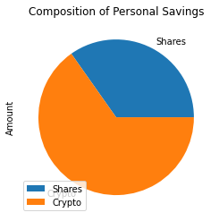
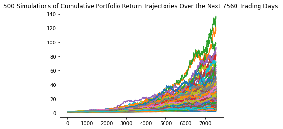
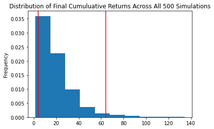

# Personal Finacial Planner


```python
import os
import requests
import pandas as pd
from dotenv import load_dotenv
import alpaca_trade_api as tradeapi
from MCForecastTools import MCSimulation

%matplotlib inline
```


```python
# Load .env enviroment
load_dotenv()
```


    True


```python
my_btc = 1.2
my_eth = 5.3

# current amount of crypto assets
crypto_assets = {
    "my_crypto": [my_btc, my_eth]}

#crypto tickers
crypto_tickers = ["BTC", "ETH"]
```


```python
# Create the shares DataFrame
ct_shares = pd.DataFrame(crypto_assets, index=crypto_tickers)

# Display shares data
#ct_shares

```


```python
# Fetch current BTC price
btc_url = "https://api.alternative.me/v2/ticker/Bitcoin/?convert=CAD"
response = requests.get(btc_url)
#print(response)

data = response.json()
#print(data)

btc_price = data['data']['1']["quotes"]["USD"]["price"]

#print(btc_price)

# Fetch current ETH price
eth_url = "https://api.alternative.me/v2/ticker/Ethereum/?convert=CAD"
response = requests.get(eth_url)
#print(response)

data = response.json()
#print(data)

eth_price = data['data']['1027']["quotes"]["USD"]["price"]

#print(eth_price)


# Compute current value of my crpto
my_btc_value = btc_price * ct_shares.loc["BTC"]["my_crypto"]
my_eth_value = eth_price * ct_shares.loc["ETH"]["my_crypto"]

# Print current crypto wallet balance
print(f"The current value of your {my_btc} BTC is ${my_btc_value:0.2f}")
print(f"The current value of your {my_eth} ETH is ${my_eth_value:0.2f}")

###Stock Portfolio###


# Set current amount of shares
my_agg = 200
my_spy = 50

# Set Alpaca API key and secret
alpaca_api_key = os.getenv("ALPACA_API_KEY")
alpaca_secret_key = os.getenv("ALPACA_SECRET_KEY")

# Create the Alpaca API object
alpaca = tradeapi.REST(
    alpaca_api_key,
    alpaca_secret_key,
    api_version="v2")
# Format current date as ISO format
today = pd.Timestamp("2020-10-09", tz="America/New_York").isoformat()

# Set the tickers
tickers = ["AGG", "SPY"]

# Set timeframe to '1D' for Alpaca API
timeframe = "1D"

# Get current closing prices for SPY and AGG
df_closing_prices = pd.DataFrame()


df_ticker = alpaca.get_barset(
    tickers,
    timeframe,
    #start=start_date,
    #end=end_date,
    limit=1,
).df

for ticker in tickers:
    df_closing_prices[ticker] = df_ticker[ticker]["close"]

# (use a limit=1000 parameter to call the most recent 1000 days of data)


#df_closing_prices


#Latest closing price
agg_price = (float(df_ticker["AGG"]["close"]))
spy_price = (float(df_ticker["SPY"]["close"]))

#Calculate value at close
agg_close_price = agg_price * my_agg
spy_close_price = spy_price * my_spy

# Print AGG and SPY close prices
print(f"The current value of your {my_agg} AGG is ${agg_close_price}")
print(f"The current value of your {my_spy} SPY is ${spy_close_price}")
```

    The current value of your 1.2 BTC is $65734.80
    The current value of your 5.3 ETH is $18116.41
    The current value of your 200 AGG is $22824.0
    The current value of your 50 SPY is $21891.0


## Savings Health Analysis


```python
# Set monthly household income
monthly_income = 12000
```


```python
#combined shares and cypto totals

num1 = (float(agg_close_price))
num2 = (float(spy_close_price))

share_total = num1 + num2

share_total

bitc = (float(my_btc_value))
ethc = (float(my_eth_value))

crypto_total = bitc + ethc
```


```python
# Consolidate financial assets data
savings_data = [ share_total, crypto_total]  

#Creating Savings DataFrame

df_savings = pd.DataFrame(savings_data, columns=["Amount"], index=["Shares", "Crypto"])

df_savings       
```


<div>
<style scoped>
    .dataframe tbody tr th:only-of-type {
        vertical-align: middle;
    }

    .dataframe tbody tr th {
        vertical-align: top;
    }

    .dataframe thead th {
        text-align: right;
    }
</style>
<table border="1" class="dataframe">
  <thead>
    <tr style="text-align: right;">
      <th></th>
      <th>Amount</th>
    </tr>
  </thead>
  <tbody>
    <tr>
      <th>Shares</th>
      <td>44715.000</td>
    </tr>
    <tr>
      <th>Crypto</th>
      <td>83851.207</td>
    </tr>
  </tbody>
</table>
</div>


```python
df_savings.plot.pie(y= 'Amount', title= "Composition of Personal Savings");
```


    

    


```python
# Set ideal emergency fund
emergency_fund = monthly_income * 3

# Calculate total amount of savings
total_savings = crypto_total + share_total
```


```python
# Validate saving health
if emergency_fund < total_savings:
    print ("Congratulations! You have enough money in your emergency fund. ")
```

    Congratulations! You have enough money in your emergency fund. 


## Retirement Planning


```python
# Set start and end dates of five years back from today.
# Sample results may vary from the solution based on the time frame chosen
start_date = pd.Timestamp('2016-10-09', tz='America/New_York').isoformat()
end_date = pd.Timestamp('2021-10-09', tz='America/New_York').isoformat()

df_stock_data = alpaca.get_barset(
    tickers,
    timeframe,
    #start=start_date,
    #end=end_date,
    limit=1000,
).df

df_stock_data.head()
```


<div>
<style scoped>
    .dataframe tbody tr th:only-of-type {
        vertical-align: middle;
    }

    .dataframe tbody tr th {
        vertical-align: top;
    }

    .dataframe thead tr th {
        text-align: left;
    }

    .dataframe thead tr:last-of-type th {
        text-align: right;
    }
</style>
<table border="1" class="dataframe">
  <thead>
    <tr>
      <th></th>
      <th colspan="5" halign="left">AGG</th>
      <th colspan="5" halign="left">SPY</th>
    </tr>
    <tr>
      <th></th>
      <th>open</th>
      <th>high</th>
      <th>low</th>
      <th>close</th>
      <th>volume</th>
      <th>open</th>
      <th>high</th>
      <th>low</th>
      <th>close</th>
      <th>volume</th>
    </tr>
    <tr>
      <th>time</th>
      <th></th>
      <th></th>
      <th></th>
      <th></th>
      <th></th>
      <th></th>
      <th></th>
      <th></th>
      <th></th>
      <th></th>
    </tr>
  </thead>
  <tbody>
    <tr>
      <th>2017-10-19 00:00:00-04:00</th>
      <td>109.71</td>
      <td>109.750</td>
      <td>109.54</td>
      <td>109.610</td>
      <td>1747693</td>
      <td>254.82</td>
      <td>255.82</td>
      <td>254.35</td>
      <td>255.82</td>
      <td>41439302</td>
    </tr>
    <tr>
      <th>2017-10-20 00:00:00-04:00</th>
      <td>109.32</td>
      <td>109.405</td>
      <td>109.26</td>
      <td>109.305</td>
      <td>1768427</td>
      <td>256.70</td>
      <td>257.14</td>
      <td>256.42</td>
      <td>257.08</td>
      <td>41153383</td>
    </tr>
    <tr>
      <th>2017-10-23 00:00:00-04:00</th>
      <td>109.40</td>
      <td>109.470</td>
      <td>109.36</td>
      <td>109.410</td>
      <td>1571621</td>
      <td>257.48</td>
      <td>257.51</td>
      <td>256.02</td>
      <td>256.15</td>
      <td>36345830</td>
    </tr>
    <tr>
      <th>2017-10-24 00:00:00-04:00</th>
      <td>109.23</td>
      <td>109.290</td>
      <td>109.17</td>
      <td>109.200</td>
      <td>1492997</td>
      <td>256.59</td>
      <td>256.83</td>
      <td>256.15</td>
      <td>256.55</td>
      <td>51308377</td>
    </tr>
    <tr>
      <th>2017-10-25 00:00:00-04:00</th>
      <td>108.96</td>
      <td>109.130</td>
      <td>108.95</td>
      <td>109.110</td>
      <td>2706969</td>
      <td>256.19</td>
      <td>256.31</td>
      <td>254.00</td>
      <td>255.30</td>
      <td>72200254</td>
    </tr>
  </tbody>
</table>
</div>


```python
 # Configuring a Monte Carlo simulation to forecast 30 years cumulative returns


# Set number of simulations
num_sims = 500

MC_saving_portfolio = MCSimulation(
    portfolio_data = df_stock_data,
    weights = [.40, .60],
    num_simulation = num_sims,
    num_trading_days = 252*30
)

```


```python
MC_saving_portfolio.calc_cumulative_return()
```

    Running Monte Carlo simulation number 0.
    Running Monte Carlo simulation number 10.
    Running Monte Carlo simulation number 20.
    Running Monte Carlo simulation number 30.
    Running Monte Carlo simulation number 40.
    Running Monte Carlo simulation number 50.
    Running Monte Carlo simulation number 60.
    Running Monte Carlo simulation number 70.
    Running Monte Carlo simulation number 80.
    Running Monte Carlo simulation number 90.
    Running Monte Carlo simulation number 100.
    Running Monte Carlo simulation number 110.
    Running Monte Carlo simulation number 120.
    Running Monte Carlo simulation number 130.
    Running Monte Carlo simulation number 140.
    Running Monte Carlo simulation number 150.
    Running Monte Carlo simulation number 160.
    Running Monte Carlo simulation number 170.
    Running Monte Carlo simulation number 180.
    Running Monte Carlo simulation number 190.
    Running Monte Carlo simulation number 200.
    Running Monte Carlo simulation number 210.
    Running Monte Carlo simulation number 220.
    Running Monte Carlo simulation number 230.
    Running Monte Carlo simulation number 240.
    Running Monte Carlo simulation number 250.
    Running Monte Carlo simulation number 260.
    Running Monte Carlo simulation number 270.
    Running Monte Carlo simulation number 280.
    Running Monte Carlo simulation number 290.
    Running Monte Carlo simulation number 300.
    Running Monte Carlo simulation number 310.
    Running Monte Carlo simulation number 320.
    Running Monte Carlo simulation number 330.
    Running Monte Carlo simulation number 340.
    Running Monte Carlo simulation number 350.
    Running Monte Carlo simulation number 360.
    Running Monte Carlo simulation number 370.
    Running Monte Carlo simulation number 380.
    Running Monte Carlo simulation number 390.
    Running Monte Carlo simulation number 400.
    Running Monte Carlo simulation number 410.
    Running Monte Carlo simulation number 420.
    Running Monte Carlo simulation number 430.
    Running Monte Carlo simulation number 440.
    Running Monte Carlo simulation number 450.
    Running Monte Carlo simulation number 460.
    Running Monte Carlo simulation number 470.
    Running Monte Carlo simulation number 480.
    Running Monte Carlo simulation number 490.


<div>
<style scoped>
    .dataframe tbody tr th:only-of-type {
        vertical-align: middle;
    }

    .dataframe tbody tr th {
        vertical-align: top;
    }

    .dataframe thead th {
        text-align: right;
    }
</style>
<table border="1" class="dataframe">
  <thead>
    <tr style="text-align: right;">
      <th></th>
      <th>0</th>
      <th>1</th>
      <th>2</th>
      <th>3</th>
      <th>4</th>
      <th>5</th>
      <th>6</th>
      <th>7</th>
      <th>8</th>
      <th>9</th>
      <th>...</th>
      <th>490</th>
      <th>491</th>
      <th>492</th>
      <th>493</th>
      <th>494</th>
      <th>495</th>
      <th>496</th>
      <th>497</th>
      <th>498</th>
      <th>499</th>
    </tr>
  </thead>
  <tbody>
    <tr>
      <th>0</th>
      <td>1.000000</td>
      <td>1.000000</td>
      <td>1.000000</td>
      <td>1.000000</td>
      <td>1.000000</td>
      <td>1.000000</td>
      <td>1.000000</td>
      <td>1.000000</td>
      <td>1.000000</td>
      <td>1.000000</td>
      <td>...</td>
      <td>1.000000</td>
      <td>1.000000</td>
      <td>1.000000</td>
      <td>1.000000</td>
      <td>1.000000</td>
      <td>1.000000</td>
      <td>1.000000</td>
      <td>1.000000</td>
      <td>1.000000</td>
      <td>1.000000</td>
    </tr>
    <tr>
      <th>1</th>
      <td>1.019308</td>
      <td>1.010889</td>
      <td>0.994984</td>
      <td>1.001645</td>
      <td>1.015608</td>
      <td>0.991173</td>
      <td>1.001347</td>
      <td>1.019235</td>
      <td>1.004734</td>
      <td>1.003336</td>
      <td>...</td>
      <td>0.991196</td>
      <td>0.991972</td>
      <td>1.006297</td>
      <td>0.995267</td>
      <td>1.000500</td>
      <td>1.013952</td>
      <td>0.983971</td>
      <td>1.016306</td>
      <td>0.997416</td>
      <td>0.987313</td>
    </tr>
    <tr>
      <th>2</th>
      <td>1.018333</td>
      <td>1.020676</td>
      <td>0.997816</td>
      <td>1.003720</td>
      <td>1.012320</td>
      <td>0.996214</td>
      <td>1.006743</td>
      <td>1.009746</td>
      <td>1.002317</td>
      <td>1.003320</td>
      <td>...</td>
      <td>0.990329</td>
      <td>1.006285</td>
      <td>1.002475</td>
      <td>0.985551</td>
      <td>1.009259</td>
      <td>1.014206</td>
      <td>0.972809</td>
      <td>1.020764</td>
      <td>0.993203</td>
      <td>0.993810</td>
    </tr>
    <tr>
      <th>3</th>
      <td>1.014989</td>
      <td>1.020484</td>
      <td>1.002731</td>
      <td>0.997908</td>
      <td>1.029246</td>
      <td>0.994139</td>
      <td>1.017547</td>
      <td>1.022615</td>
      <td>1.007427</td>
      <td>0.993448</td>
      <td>...</td>
      <td>0.996990</td>
      <td>1.017654</td>
      <td>1.002552</td>
      <td>0.982324</td>
      <td>0.996010</td>
      <td>1.012223</td>
      <td>0.975944</td>
      <td>1.016007</td>
      <td>0.993506</td>
      <td>0.984575</td>
    </tr>
    <tr>
      <th>4</th>
      <td>1.023514</td>
      <td>1.019538</td>
      <td>0.997651</td>
      <td>0.993294</td>
      <td>1.038552</td>
      <td>0.990287</td>
      <td>1.013260</td>
      <td>1.028400</td>
      <td>1.006368</td>
      <td>1.002041</td>
      <td>...</td>
      <td>1.005255</td>
      <td>1.016412</td>
      <td>1.001639</td>
      <td>0.991715</td>
      <td>1.007240</td>
      <td>1.006304</td>
      <td>0.972762</td>
      <td>1.034615</td>
      <td>0.994232</td>
      <td>0.993668</td>
    </tr>
    <tr>
      <th>...</th>
      <td>...</td>
      <td>...</td>
      <td>...</td>
      <td>...</td>
      <td>...</td>
      <td>...</td>
      <td>...</td>
      <td>...</td>
      <td>...</td>
      <td>...</td>
      <td>...</td>
      <td>...</td>
      <td>...</td>
      <td>...</td>
      <td>...</td>
      <td>...</td>
      <td>...</td>
      <td>...</td>
      <td>...</td>
      <td>...</td>
      <td>...</td>
    </tr>
    <tr>
      <th>7556</th>
      <td>31.211870</td>
      <td>18.416612</td>
      <td>8.712891</td>
      <td>21.720839</td>
      <td>64.587461</td>
      <td>27.832295</td>
      <td>17.552504</td>
      <td>7.570860</td>
      <td>8.181760</td>
      <td>5.010250</td>
      <td>...</td>
      <td>50.715115</td>
      <td>28.258004</td>
      <td>6.950072</td>
      <td>18.452719</td>
      <td>17.625488</td>
      <td>11.165427</td>
      <td>36.495509</td>
      <td>48.641232</td>
      <td>26.719486</td>
      <td>6.664951</td>
    </tr>
    <tr>
      <th>7557</th>
      <td>31.220143</td>
      <td>18.536015</td>
      <td>8.765597</td>
      <td>21.754991</td>
      <td>63.639945</td>
      <td>27.868687</td>
      <td>17.711024</td>
      <td>7.734373</td>
      <td>8.243104</td>
      <td>4.998411</td>
      <td>...</td>
      <td>50.690901</td>
      <td>28.527694</td>
      <td>6.829064</td>
      <td>18.329201</td>
      <td>17.640596</td>
      <td>11.209381</td>
      <td>35.869144</td>
      <td>48.879629</td>
      <td>26.513830</td>
      <td>6.723064</td>
    </tr>
    <tr>
      <th>7558</th>
      <td>31.551271</td>
      <td>18.497686</td>
      <td>8.729119</td>
      <td>21.775694</td>
      <td>64.106213</td>
      <td>27.225532</td>
      <td>17.607685</td>
      <td>7.813470</td>
      <td>8.365284</td>
      <td>4.996743</td>
      <td>...</td>
      <td>50.597046</td>
      <td>28.632393</td>
      <td>6.858111</td>
      <td>17.915400</td>
      <td>17.687261</td>
      <td>11.270927</td>
      <td>35.694010</td>
      <td>48.452321</td>
      <td>26.761465</td>
      <td>6.785758</td>
    </tr>
    <tr>
      <th>7559</th>
      <td>31.338978</td>
      <td>18.584702</td>
      <td>8.756774</td>
      <td>21.823071</td>
      <td>65.020717</td>
      <td>27.146313</td>
      <td>17.426283</td>
      <td>7.858088</td>
      <td>8.380220</td>
      <td>4.995531</td>
      <td>...</td>
      <td>51.042072</td>
      <td>28.866840</td>
      <td>6.846388</td>
      <td>17.971550</td>
      <td>17.841214</td>
      <td>11.121815</td>
      <td>36.187811</td>
      <td>48.729937</td>
      <td>26.901770</td>
      <td>6.820054</td>
    </tr>
    <tr>
      <th>7560</th>
      <td>31.016485</td>
      <td>18.711640</td>
      <td>8.690317</td>
      <td>22.159589</td>
      <td>64.907134</td>
      <td>27.416976</td>
      <td>17.429634</td>
      <td>7.846900</td>
      <td>8.361792</td>
      <td>4.971170</td>
      <td>...</td>
      <td>50.414174</td>
      <td>28.703560</td>
      <td>6.861698</td>
      <td>18.183296</td>
      <td>17.851904</td>
      <td>11.018417</td>
      <td>35.902007</td>
      <td>47.885568</td>
      <td>26.850092</td>
      <td>6.819966</td>
    </tr>
  </tbody>
</table>
<p>7561 rows × 500 columns</p>
</div>


```python
# simulation outcomes

porfilio_line_plot = MC_saving_portfolio.plot_simulation()
```


    

    


```python
# probability distribution and confidence intervals

dist_plot = MC_saving_portfolio.plot_distribution()
```


    

    


```python
#simulation summary

portfolio_tbl = MC_saving_portfolio.summarize_cumulative_return()

# Print summary statistics
print(portfolio_tbl)
```

    count           500.000000
    mean             20.104450
    std              16.367129
    min               1.426785
    25%               9.266591
    50%              15.495360
    75%              25.787046
    max             134.203936
    95% CI Lower      3.994729
    95% CI Upper     64.295853
    Name: 7560, dtype: float64


```python
# Use the lower and upper `95%` confidence intervals to calculate the range of the possible outcomes of our $20,000 investments
ci_lower = round(portfolio_tbl[8]*20000,2)
ci_upper = round(portfolio_tbl[9]*20000,2)

print(f"There is a 95% chance that an initial investment of $20,000 in the portfolio"
      f" over the next year will end within in the range of"
      f" ${ci_lower} and ${ci_upper}.")
```

    There is a 95% chance that an initial investment of $20,000 in the portfolio over the next year will end within in the range of $79894.58 and $1285917.06.


```python
# Use the lower and upper `95%` confidence intervals to calculate the range of the possible outcomes of our $30,000 investments
ci_lower = round(portfolio_tbl[8]*30000,2)
ci_upper = round(portfolio_tbl[9]*0000,2)

print(f"There is a 95% chance that an initial investment of $20,000 in the portfolio"
      f" over the next year will end within in the range of"
      f" ${ci_lower} and ${ci_upper}.")
```

    There is a 95% chance that an initial investment of $20,000 in the portfolio over the next year will end within in the range of $119841.87 and $0.0.


```python

```
