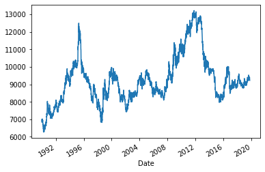
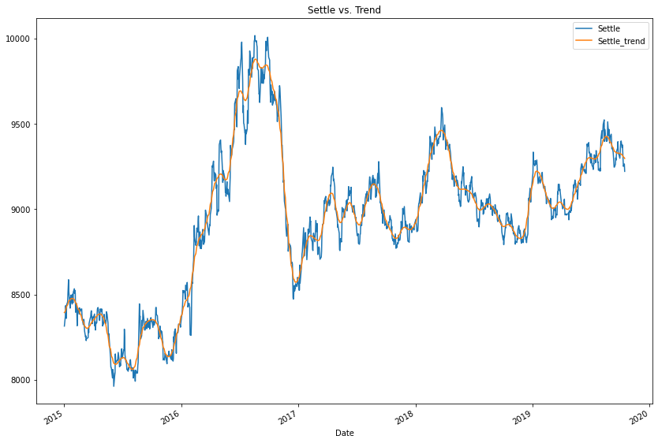
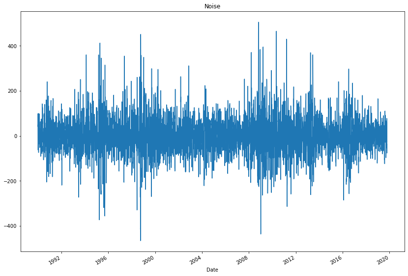
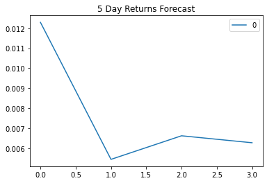
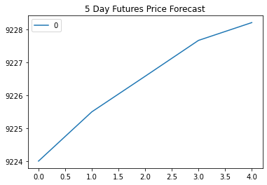
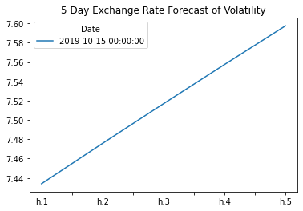

```python
import numpy as np
import pandas as pd
from pathlib import Path

import warnings
warnings.filterwarnings('ignore')

%matplotlib inline
```

# Return Forecasting: Read Historical Daily Yen Futures Data
In this notebook, you will load historical Dollar-Yen exchange rate futures data and apply time series analysis and modeling to determine whether there is any predictable behavior.


```python
# Futures contract on the Yen-dollar exchange rate:
# This is the continuous chain of the futures contracts that are 1 month to expiration
yen_futures = pd.read_csv(
    Path("yen.csv"), index_col="Date", infer_datetime_format=True, parse_dates=True
)
yen_futures.head()
```


<div>
<style scoped>
    .dataframe tbody tr th:only-of-type {
        vertical-align: middle;
    }

    .dataframe tbody tr th {
        vertical-align: top;
    }

    .dataframe thead th {
        text-align: right;
    }
</style>
<table border="1" class="dataframe">
  <thead>
    <tr style="text-align: right;">
      <th></th>
      <th>Open</th>
      <th>High</th>
      <th>Low</th>
      <th>Last</th>
      <th>Change</th>
      <th>Settle</th>
      <th>Volume</th>
      <th>Previous Day Open Interest</th>
    </tr>
    <tr>
      <th>Date</th>
      <th></th>
      <th></th>
      <th></th>
      <th></th>
      <th></th>
      <th></th>
      <th></th>
      <th></th>
    </tr>
  </thead>
  <tbody>
    <tr>
      <th>1976-08-02</th>
      <td>3398.0</td>
      <td>3401.0</td>
      <td>3398.0</td>
      <td>3401.0</td>
      <td>NaN</td>
      <td>3401.0</td>
      <td>2.0</td>
      <td>1.0</td>
    </tr>
    <tr>
      <th>1976-08-03</th>
      <td>3401.0</td>
      <td>3401.0</td>
      <td>3401.0</td>
      <td>3401.0</td>
      <td>NaN</td>
      <td>3401.0</td>
      <td>0.0</td>
      <td>1.0</td>
    </tr>
    <tr>
      <th>1976-08-04</th>
      <td>3401.0</td>
      <td>3401.0</td>
      <td>3401.0</td>
      <td>3401.0</td>
      <td>NaN</td>
      <td>3401.0</td>
      <td>0.0</td>
      <td>1.0</td>
    </tr>
    <tr>
      <th>1976-08-05</th>
      <td>3401.0</td>
      <td>3401.0</td>
      <td>3401.0</td>
      <td>3401.0</td>
      <td>NaN</td>
      <td>3401.0</td>
      <td>0.0</td>
      <td>1.0</td>
    </tr>
    <tr>
      <th>1976-08-06</th>
      <td>3401.0</td>
      <td>3401.0</td>
      <td>3401.0</td>
      <td>3401.0</td>
      <td>NaN</td>
      <td>3401.0</td>
      <td>0.0</td>
      <td>1.0</td>
    </tr>
  </tbody>
</table>
</div>


```python
# Trim the dataset to begin on January 1st, 1990
yen_futures = yen_futures.loc["1990-01-01":, :]
yen_futures.head()
```


<div>
<style scoped>
    .dataframe tbody tr th:only-of-type {
        vertical-align: middle;
    }

    .dataframe tbody tr th {
        vertical-align: top;
    }

    .dataframe thead th {
        text-align: right;
    }
</style>
<table border="1" class="dataframe">
  <thead>
    <tr style="text-align: right;">
      <th></th>
      <th>Open</th>
      <th>High</th>
      <th>Low</th>
      <th>Last</th>
      <th>Change</th>
      <th>Settle</th>
      <th>Volume</th>
      <th>Previous Day Open Interest</th>
    </tr>
    <tr>
      <th>Date</th>
      <th></th>
      <th></th>
      <th></th>
      <th></th>
      <th></th>
      <th></th>
      <th></th>
      <th></th>
    </tr>
  </thead>
  <tbody>
    <tr>
      <th>1990-01-02</th>
      <td>6954.0</td>
      <td>6954.0</td>
      <td>6835.0</td>
      <td>6847.0</td>
      <td>NaN</td>
      <td>6847.0</td>
      <td>48336.0</td>
      <td>51473.0</td>
    </tr>
    <tr>
      <th>1990-01-03</th>
      <td>6877.0</td>
      <td>6910.0</td>
      <td>6865.0</td>
      <td>6887.0</td>
      <td>NaN</td>
      <td>6887.0</td>
      <td>38206.0</td>
      <td>53860.0</td>
    </tr>
    <tr>
      <th>1990-01-04</th>
      <td>6937.0</td>
      <td>7030.0</td>
      <td>6924.0</td>
      <td>7008.0</td>
      <td>NaN</td>
      <td>7008.0</td>
      <td>49649.0</td>
      <td>55699.0</td>
    </tr>
    <tr>
      <th>1990-01-05</th>
      <td>6952.0</td>
      <td>6985.0</td>
      <td>6942.0</td>
      <td>6950.0</td>
      <td>NaN</td>
      <td>6950.0</td>
      <td>29944.0</td>
      <td>53111.0</td>
    </tr>
    <tr>
      <th>1990-01-08</th>
      <td>6936.0</td>
      <td>6972.0</td>
      <td>6936.0</td>
      <td>6959.0</td>
      <td>NaN</td>
      <td>6959.0</td>
      <td>19763.0</td>
      <td>52072.0</td>
    </tr>
  </tbody>
</table>
</div>


 # Return Forecasting: Initial Time-Series Plotting

 Start by plotting the "Settle" price. Do you see any patterns, long-term and/or short?


```python
# Plot just the "Settle" column from the dataframe:
yen_futures.Settle.plot()
```


    <AxesSubplot:xlabel='Date'>


    

    


---

# Decomposition Using a Hodrick-Prescott Filter

 Using a Hodrick-Prescott Filter, decompose the Settle price into a trend and noise.


```python
import statsmodels.api as sm

# Apply the Hodrick-Prescott Filter by decomposing the "Settle" price into two separate series:
yen_settle_noise, yen_settle_trend = sm.tsa.filters.hpfilter(yen_futures['Settle'])
```


```python
# Create a dataframe of just the settle price, and add columns for "noise" and "trend" series from above:
df_yen_settle_price = pd.DataFrame(yen_futures['Settle'])
df_yen_settle_price['Noise'] = yen_settle_noise
df_yen_settle_price['Trend'] = yen_settle_trend
df_yen_settle_price.head()
```


<div>
<style scoped>
    .dataframe tbody tr th:only-of-type {
        vertical-align: middle;
    }

    .dataframe tbody tr th {
        vertical-align: top;
    }

    .dataframe thead th {
        text-align: right;
    }
</style>
<table border="1" class="dataframe">
  <thead>
    <tr style="text-align: right;">
      <th></th>
      <th>Settle</th>
      <th>Noise</th>
      <th>Trend</th>
    </tr>
    <tr>
      <th>Date</th>
      <th></th>
      <th></th>
      <th></th>
    </tr>
  </thead>
  <tbody>
    <tr>
      <th>1990-01-02</th>
      <td>6847.0</td>
      <td>-61.503967</td>
      <td>6908.503967</td>
    </tr>
    <tr>
      <th>1990-01-03</th>
      <td>6887.0</td>
      <td>-21.799756</td>
      <td>6908.799756</td>
    </tr>
    <tr>
      <th>1990-01-04</th>
      <td>7008.0</td>
      <td>98.942896</td>
      <td>6909.057104</td>
    </tr>
    <tr>
      <th>1990-01-05</th>
      <td>6950.0</td>
      <td>40.776052</td>
      <td>6909.223948</td>
    </tr>
    <tr>
      <th>1990-01-08</th>
      <td>6959.0</td>
      <td>49.689938</td>
      <td>6909.310062</td>
    </tr>
  </tbody>
</table>
</div>


```python
# Plot the Settle Price vs. the Trend for 2015 to the present
settle_price_2015_to_present = yen_futures.loc['2015-01-01':]
trend_2015_to_present = yen_settle_trend.loc['2015-01-01':]
settle_vs_trend = pd.concat([settle_price_2015_to_present, trend_2015_to_present], axis="columns", join="inner")
settle_vs_trend_slice = settle_vs_trend[['Settle', 'Settle_trend']]
settle_vs_trend_slice.plot(figsize = (14,10), title = 'Settle vs. Trend')

```


    <AxesSubplot:title={'center':'Settle vs. Trend'}, xlabel='Date'>


    

    


```python
# Plot the Settle Noise
yen_settle_noise.plot(figsize = (14,10), title = 'Noise')


```


    <AxesSubplot:title={'center':'Noise'}, xlabel='Date'>


    

    


---

# Forecasting Returns using an ARMA Model

Using futures Settle *Returns*, estimate an ARMA model

1. ARMA: Create an ARMA model and fit it to the returns data. Note: Set the AR and MA ("p" and "q") parameters to p=2 and q=1: order=(2, 1).
2. Output the ARMA summary table and take note of the p-values of the lags. Based on the p-values, is the model a good fit (p < 0.05)?
3. Plot the 5-day forecast of the forecasted returns (the results forecast from ARMA model)


```python
# Create a series using "Settle" price percentage returns, drop any nan"s, and check the results:
# (Make sure to multiply the pct_change() results by 100)
# In this case, you may have to replace inf, -inf values with np.nan"s
returns = (yen_futures[["Settle"]].pct_change() * 100)
returns = returns.replace(-np.inf, np.nan).dropna()
returns.head()
```


<div>
<style scoped>
    .dataframe tbody tr th:only-of-type {
        vertical-align: middle;
    }

    .dataframe tbody tr th {
        vertical-align: top;
    }

    .dataframe thead th {
        text-align: right;
    }
</style>
<table border="1" class="dataframe">
  <thead>
    <tr style="text-align: right;">
      <th></th>
      <th>Settle</th>
    </tr>
    <tr>
      <th>Date</th>
      <th></th>
    </tr>
  </thead>
  <tbody>
    <tr>
      <th>1990-01-03</th>
      <td>0.584197</td>
    </tr>
    <tr>
      <th>1990-01-04</th>
      <td>1.756933</td>
    </tr>
    <tr>
      <th>1990-01-05</th>
      <td>-0.827626</td>
    </tr>
    <tr>
      <th>1990-01-08</th>
      <td>0.129496</td>
    </tr>
    <tr>
      <th>1990-01-09</th>
      <td>-0.632275</td>
    </tr>
  </tbody>
</table>
</div>


```python
import statsmodels.api as sm

# Estimate and ARMA model using statsmodels (use order=(2, 1))
arma_model = sm.tsa.ARMA(returns.Settle, order=(2,1))

# Fit the model and assign it to a variable called results
results = arma_model.fit()
```

     This problem is unconstrained.


    RUNNING THE L-BFGS-B CODE
    
               * * *
    
    Machine precision = 2.220D-16
     N =            4     M =           12
    
    At X0         0 variables are exactly at the bounds
    
    At iterate    0    f=  1.05058D+00    |proj g|=  5.17697D-04
    
    At iterate    5    f=  1.05058D+00    |proj g|=  2.19824D-06
    
    At iterate   10    f=  1.05058D+00    |proj g|=  6.34381D-05
    
    At iterate   15    f=  1.05058D+00    |proj g|=  3.26761D-04
    
    At iterate   20    f=  1.05058D+00    |proj g|=  2.75113D-05
    
               * * *
    
    Tit   = total number of iterations
    Tnf   = total number of function evaluations
    Tnint = total number of segments explored during Cauchy searches
    Skip  = number of BFGS updates skipped
    Nact  = number of active bounds at final generalized Cauchy point
    Projg = norm of the final projected gradient
    F     = final function value
    
               * * *
    
       N    Tit     Tnf  Tnint  Skip  Nact     Projg        F
        4     24     30      1     0     0   4.441D-08   1.051D+00
      F =   1.0505817371327046     
    
    CONVERGENCE: REL_REDUCTION_OF_F_<=_FACTR*EPSMCH             


```python
# Output model summary results:
results.summary()
```


<table class="simpletable">
<caption>ARMA Model Results</caption>
<tr>
  <th>Dep. Variable:</th>      <td>Settle</td>      <th>  No. Observations:  </th>   <td>7514</td>   
</tr>
<tr>
  <th>Model:</th>            <td>ARMA(2, 1)</td>    <th>  Log Likelihood     </th> <td>-7894.071</td>
</tr>
<tr>
  <th>Method:</th>             <td>css-mle</td>     <th>  S.D. of innovations</th>   <td>0.692</td>  
</tr>
<tr>
  <th>Date:</th>          <td>Sun, 14 Nov 2021</td> <th>  AIC                </th> <td>15798.142</td>
</tr>
<tr>
  <th>Time:</th>              <td>22:47:12</td>     <th>  BIC                </th> <td>15832.765</td>
</tr>
<tr>
  <th>Sample:</th>                <td>0</td>        <th>  HQIC               </th> <td>15810.030</td>
</tr>
<tr>
  <th></th>                       <td> </td>        <th>                     </th>     <td> </td>    
</tr>
</table>
<table class="simpletable">
<tr>
        <td></td>          <th>coef</th>     <th>std err</th>      <th>z</th>      <th>P>|z|</th>  <th>[0.025</th>    <th>0.975]</th>  
</tr>
<tr>
  <th>const</th>        <td>    0.0063</td> <td>    0.008</td> <td>    0.804</td> <td> 0.422</td> <td>   -0.009</td> <td>    0.022</td>
</tr>
<tr>
  <th>ar.L1.Settle</th> <td>   -0.3062</td> <td>    1.277</td> <td>   -0.240</td> <td> 0.811</td> <td>   -2.810</td> <td>    2.197</td>
</tr>
<tr>
  <th>ar.L2.Settle</th> <td>   -0.0019</td> <td>    0.019</td> <td>   -0.099</td> <td> 0.921</td> <td>   -0.040</td> <td>    0.036</td>
</tr>
<tr>
  <th>ma.L1.Settle</th> <td>    0.2947</td> <td>    1.277</td> <td>    0.231</td> <td> 0.818</td> <td>   -2.209</td> <td>    2.798</td>
</tr>
</table>
<table class="simpletable">
<caption>Roots</caption>
<tr>
    <td></td>   <th>            Real</th>  <th>         Imaginary</th> <th>         Modulus</th>  <th>        Frequency</th>
</tr>
<tr>
  <th>AR.1</th> <td>          -3.3346</td> <td>          +0.0000j</td> <td>           3.3346</td> <td>           0.5000</td>
</tr>
<tr>
  <th>AR.2</th> <td>        -157.1807</td> <td>          +0.0000j</td> <td>         157.1807</td> <td>           0.5000</td>
</tr>
<tr>
  <th>MA.1</th> <td>          -3.3935</td> <td>          +0.0000j</td> <td>           3.3935</td> <td>           0.5000</td>
</tr>
</table>


```python
# Plot the 5 Day Returns Forecast
pd.DataFrame(results.forecast(steps=4)[0]).plot(title="5 Day Returns Forecast")

```


    <AxesSubplot:title={'center':'5 Day Returns Forecast'}>


    

    


---

# Forecasting the Settle Price using an ARIMA Model

 1. Using the *raw* Yen **Settle Price**, estimate an ARIMA model.
     1. Set P=5, D=1, and Q=1 in the model (e.g., ARIMA(df, order=(5,1,1))
     2. P= # of Auto-Regressive Lags, D= # of Differences (this is usually =1), Q= # of Moving Average Lags
 2. Output the ARIMA summary table and take note of the p-values of the lags. Based on the p-values, is the model a good fit (p < 0.05)?
 3. Construct a 5 day forecast for the Settle Price. What does the model forecast will happen to the Japanese Yen in the near term?


```python
from statsmodels.tsa.arima_model import ARIMA


# Estimate and ARIMA Model:
# Hint: ARIMA(df, order=(p, d, q))

arima_model = sm.tsa.ARIMA(yen_futures.Settle, order=(5,1,1))


# Fit the model

arima_results = arima_model.fit()
```

     This problem is unconstrained.


    RUNNING THE L-BFGS-B CODE
    
               * * *
    
    Machine precision = 2.220D-16
     N =            7     M =           12
    
    At X0         0 variables are exactly at the bounds
    
    At iterate    0    f=  5.58220D+00    |proj g|=  8.76632D-05
    
    At iterate    5    f=  5.58220D+00    |proj g|=  1.14575D-05
    
    At iterate   10    f=  5.58220D+00    |proj g|=  1.08624D-04
    
    At iterate   15    f=  5.58220D+00    |proj g|=  5.59552D-06
    
    At iterate   20    f=  5.58220D+00    |proj g|=  7.70939D-05
    
    At iterate   25    f=  5.58220D+00    |proj g|=  1.15463D-06
    
    At iterate   30    f=  5.58220D+00    |proj g|=  2.66454D-07
    
               * * *
    
    Tit   = total number of iterations
    Tnf   = total number of function evaluations
    Tnint = total number of segments explored during Cauchy searches
    Skip  = number of BFGS updates skipped
    Nact  = number of active bounds at final generalized Cauchy point
    Projg = norm of the final projected gradient
    F     = final function value
    
               * * *
    
       N    Tit     Tnf  Tnint  Skip  Nact     Projg        F
        7     32     47      1     0     0   1.776D-07   5.582D+00
      F =   5.5821957916136649     
    
    CONVERGENCE: REL_REDUCTION_OF_F_<=_FACTR*EPSMCH             


```python
# Output model summary results:
results.summary()
```


<table class="simpletable">
<caption>ARMA Model Results</caption>
<tr>
  <th>Dep. Variable:</th>      <td>Settle</td>      <th>  No. Observations:  </th>   <td>7514</td>   
</tr>
<tr>
  <th>Model:</th>            <td>ARMA(2, 1)</td>    <th>  Log Likelihood     </th> <td>-7894.071</td>
</tr>
<tr>
  <th>Method:</th>             <td>css-mle</td>     <th>  S.D. of innovations</th>   <td>0.692</td>  
</tr>
<tr>
  <th>Date:</th>          <td>Sun, 14 Nov 2021</td> <th>  AIC                </th> <td>15798.142</td>
</tr>
<tr>
  <th>Time:</th>              <td>22:47:44</td>     <th>  BIC                </th> <td>15832.765</td>
</tr>
<tr>
  <th>Sample:</th>                <td>0</td>        <th>  HQIC               </th> <td>15810.030</td>
</tr>
<tr>
  <th></th>                       <td> </td>        <th>                     </th>     <td> </td>    
</tr>
</table>
<table class="simpletable">
<tr>
        <td></td>          <th>coef</th>     <th>std err</th>      <th>z</th>      <th>P>|z|</th>  <th>[0.025</th>    <th>0.975]</th>  
</tr>
<tr>
  <th>const</th>        <td>    0.0063</td> <td>    0.008</td> <td>    0.804</td> <td> 0.422</td> <td>   -0.009</td> <td>    0.022</td>
</tr>
<tr>
  <th>ar.L1.Settle</th> <td>   -0.3062</td> <td>    1.277</td> <td>   -0.240</td> <td> 0.811</td> <td>   -2.810</td> <td>    2.197</td>
</tr>
<tr>
  <th>ar.L2.Settle</th> <td>   -0.0019</td> <td>    0.019</td> <td>   -0.099</td> <td> 0.921</td> <td>   -0.040</td> <td>    0.036</td>
</tr>
<tr>
  <th>ma.L1.Settle</th> <td>    0.2947</td> <td>    1.277</td> <td>    0.231</td> <td> 0.818</td> <td>   -2.209</td> <td>    2.798</td>
</tr>
</table>
<table class="simpletable">
<caption>Roots</caption>
<tr>
    <td></td>   <th>            Real</th>  <th>         Imaginary</th> <th>         Modulus</th>  <th>        Frequency</th>
</tr>
<tr>
  <th>AR.1</th> <td>          -3.3346</td> <td>          +0.0000j</td> <td>           3.3346</td> <td>           0.5000</td>
</tr>
<tr>
  <th>AR.2</th> <td>        -157.1807</td> <td>          +0.0000j</td> <td>         157.1807</td> <td>           0.5000</td>
</tr>
<tr>
  <th>MA.1</th> <td>          -3.3935</td> <td>          +0.0000j</td> <td>           3.3935</td> <td>           0.5000</td>
</tr>
</table>


```python
# Plot the 5 Day Price Forecast
pd.DataFrame(arima_results.forecast(steps=5)[0]).plot(title="5 Day Futures Price Forecast")

```


    <AxesSubplot:title={'center':'5 Day Futures Price Forecast'}>


    

    


---

# Volatility Forecasting with GARCH

Rather than predicting returns, let's forecast near-term **volatility** of Japanese Yen futures returns. Being able to accurately predict volatility will be extremely useful if we want to trade in derivatives or quantify our maximum loss.
 
Using futures Settle *Returns*, estimate an GARCH model

1. GARCH: Create an GARCH model and fit it to the returns data. Note: Set the parameters to p=2 and q=1: order=(2, 1).
2. Output the GARCH summary table and take note of the p-values of the lags. Based on the p-values, is the model a good fit (p < 0.05)?
3. Plot the 5-day forecast of the volatility.


```python
import arch
from arch import arch_model
```


```python
# Estimate a GARCH model:
g_model = arch_model(returns.Settle, mean="Zero", vol="GARCH", p=2, q=1)

# Fit the model
garch_results = g_model.fit(disp="off")

```


```python
# Summarize the model results
garch_results.summary()

```


<table class="simpletable">
<caption>Zero Mean - GARCH Model Results</caption>
<tr>
  <th>Dep. Variable:</th>       <td>Settle</td>       <th>  R-squared:         </th>  <td>   0.000</td> 
</tr>
<tr>
  <th>Mean Model:</th>         <td>Zero Mean</td>     <th>  Adj. R-squared:    </th>  <td>   0.000</td> 
</tr>
<tr>
  <th>Vol Model:</th>            <td>GARCH</td>       <th>  Log-Likelihood:    </th> <td>  -7461.93</td>
</tr>
<tr>
  <th>Distribution:</th>        <td>Normal</td>       <th>  AIC:               </th> <td>   14931.9</td>
</tr>
<tr>
  <th>Method:</th>        <td>Maximum Likelihood</td> <th>  BIC:               </th> <td>   14959.6</td>
</tr>
<tr>
  <th></th>                        <td></td>          <th>  No. Observations:  </th>    <td>7514</td>   
</tr>
<tr>
  <th>Date:</th>           <td>Sun, Nov 14 2021</td>  <th>  Df Residuals:      </th>    <td>7514</td>   
</tr>
<tr>
  <th>Time:</th>               <td>22:47:58</td>      <th>  Df Model:          </th>      <td>0</td>    
</tr>
</table>
<table class="simpletable">
<caption>Volatility Model</caption>
<tr>
      <td></td>        <th>coef</th>     <th>std err</th>      <th>t</th>       <th>P>|t|</th>      <th>95.0% Conf. Int.</th>   
</tr>
<tr>
  <th>omega</th>    <td>4.2896e-03</td> <td>2.057e-03</td> <td>    2.085</td> <td>3.707e-02</td>  <td>[2.571e-04,8.322e-03]</td>
</tr>
<tr>
  <th>alpha[1]</th> <td>    0.0381</td> <td>1.282e-02</td> <td>    2.970</td> <td>2.974e-03</td>  <td>[1.295e-02,6.321e-02]</td>
</tr>
<tr>
  <th>alpha[2]</th>   <td>0.0000</td>   <td>1.703e-02</td>   <td>0.000</td>   <td>    1.000</td> <td>[-3.338e-02,3.338e-02]</td>
</tr>
<tr>
  <th>beta[1]</th>  <td>    0.9536</td> <td>1.420e-02</td> <td>   67.135</td>   <td>0.000</td>      <td>[  0.926,  0.981]</td>  
</tr>
</table><br/><br/>Covariance estimator: robust


```python
# Find the last day of the dataset
last_day = returns.index.max().strftime('%Y-%m-%d')
last_day
```


    '2019-10-15'


```python
# Create a 5 day forecast of volatility
forecast_horizon = 5
# Start the forecast using the last_day calculated above
forecasts = garch_results.forecast(start=last_day, horizon=forecast_horizon)
forecasts
```


    <arch.univariate.base.ARCHModelForecast at 0x7f96c99cde50>


```python
# Annualize the forecast
intermediate = np.sqrt(forecasts.variance.dropna() * 252)
intermediate.head()
```


<div>
<style scoped>
    .dataframe tbody tr th:only-of-type {
        vertical-align: middle;
    }

    .dataframe tbody tr th {
        vertical-align: top;
    }

    .dataframe thead th {
        text-align: right;
    }
</style>
<table border="1" class="dataframe">
  <thead>
    <tr style="text-align: right;">
      <th></th>
      <th>h.1</th>
      <th>h.2</th>
      <th>h.3</th>
      <th>h.4</th>
      <th>h.5</th>
    </tr>
    <tr>
      <th>Date</th>
      <th></th>
      <th></th>
      <th></th>
      <th></th>
      <th></th>
    </tr>
  </thead>
  <tbody>
    <tr>
      <th>2019-10-15</th>
      <td>7.434032</td>
      <td>7.475729</td>
      <td>7.516851</td>
      <td>7.55741</td>
      <td>7.597418</td>
    </tr>
  </tbody>
</table>
</div>


```python
# Transpose the forecast so that it is easier to plot
final = intermediate.dropna().T
final.head()
```


<div>
<style scoped>
    .dataframe tbody tr th:only-of-type {
        vertical-align: middle;
    }

    .dataframe tbody tr th {
        vertical-align: top;
    }

    .dataframe thead th {
        text-align: right;
    }
</style>
<table border="1" class="dataframe">
  <thead>
    <tr style="text-align: right;">
      <th>Date</th>
      <th>2019-10-15</th>
    </tr>
  </thead>
  <tbody>
    <tr>
      <th>h.1</th>
      <td>7.434032</td>
    </tr>
    <tr>
      <th>h.2</th>
      <td>7.475729</td>
    </tr>
    <tr>
      <th>h.3</th>
      <td>7.516851</td>
    </tr>
    <tr>
      <th>h.4</th>
      <td>7.557410</td>
    </tr>
    <tr>
      <th>h.5</th>
      <td>7.597418</td>
    </tr>
  </tbody>
</table>
</div>


```python
# Plot the final forecast
final.plot(title="5 Day Exchange Rate Forecast of Volatility")

```


    <AxesSubplot:title={'center':'5 Day Exchange Rate Forecast of Volatility'}>


    

    


---

# Conclusions

Based on your time series analysis, would you buy the yen now?
-Based on analysis I would not buy yen.

Is the risk of the yen expected to increase or decrease?
-Data shows that risk is expected to increase.

Based on the model evaluation, would you feel confident in using these models for trading?
-I would be confident in using these models along with other evaluation methods but not the models alone.


